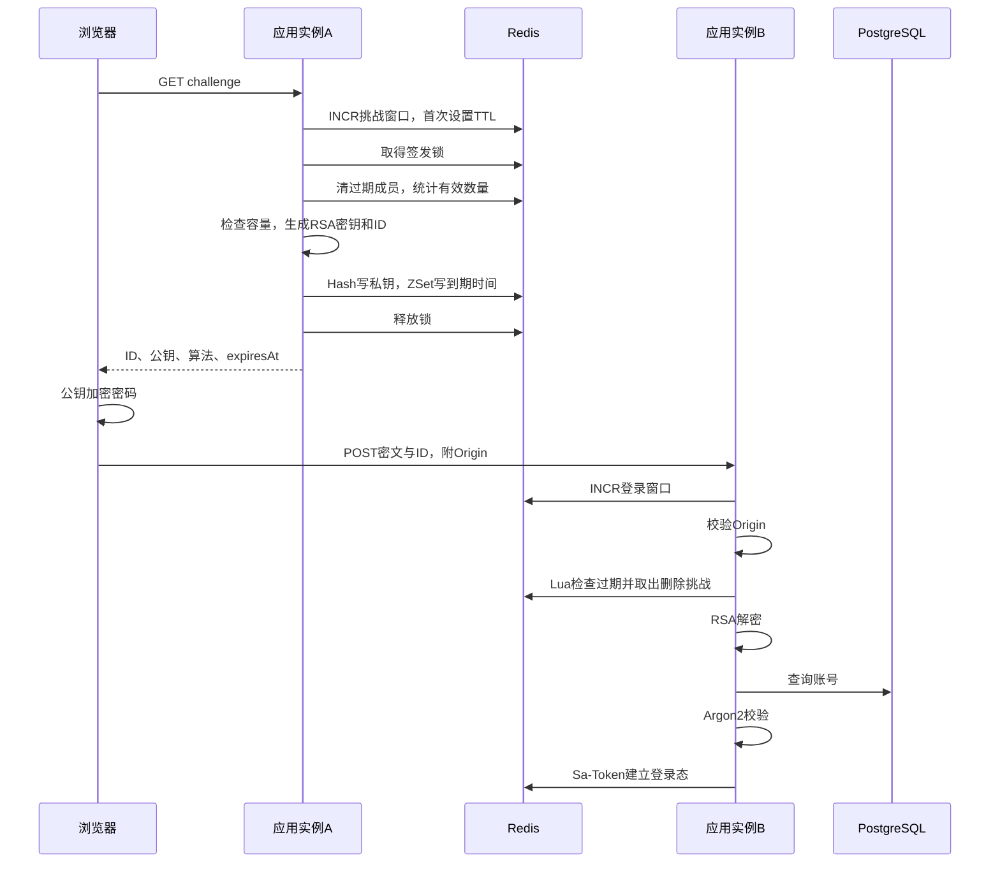
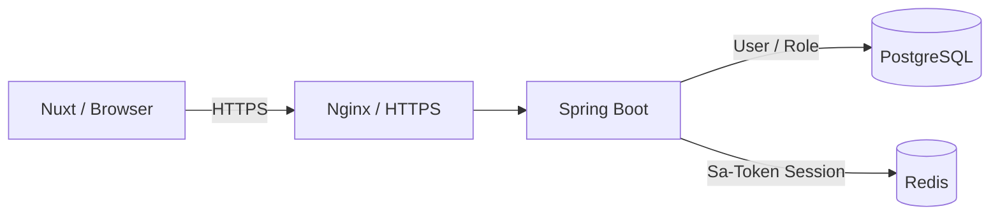
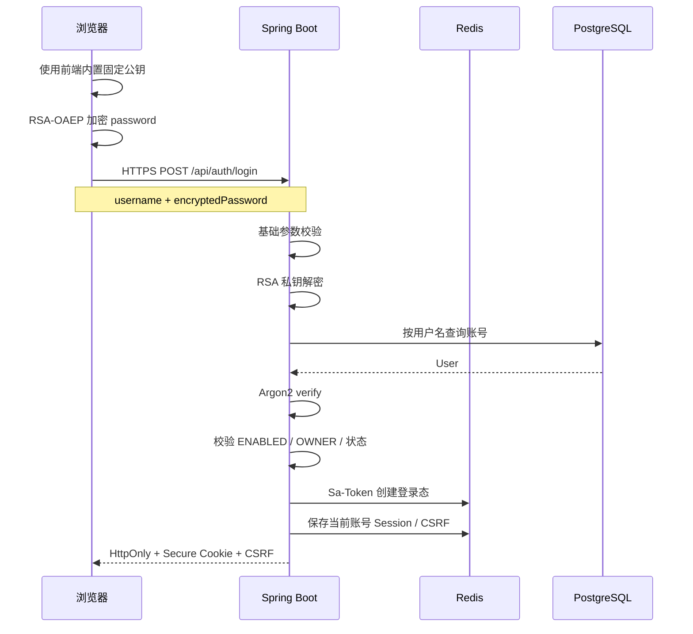
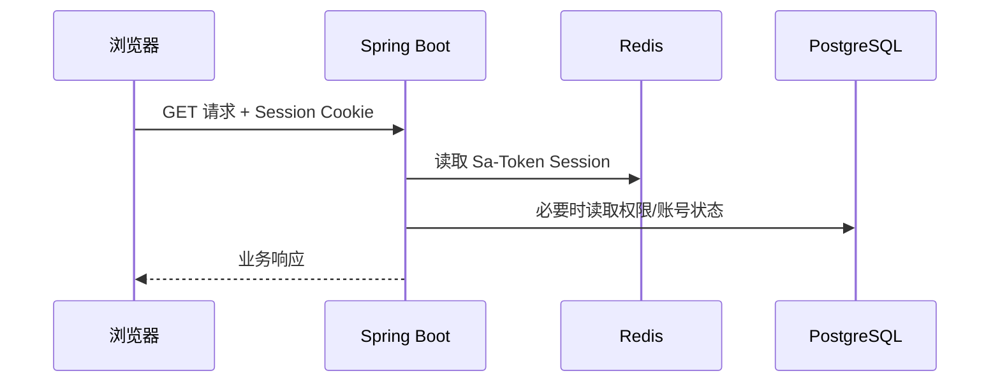
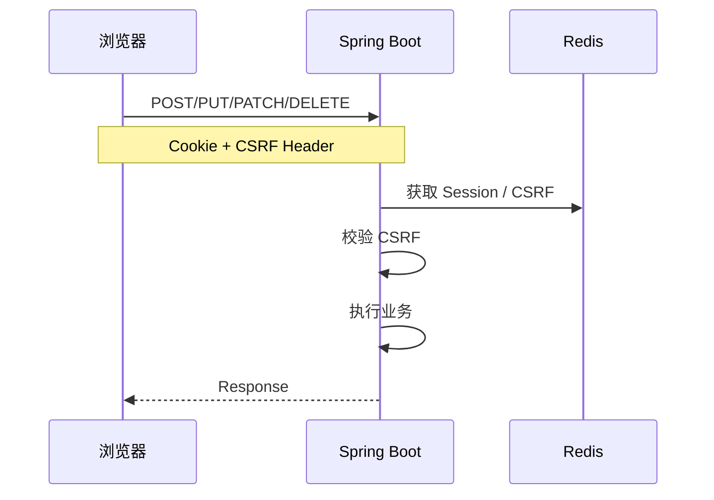

# 网站登录认证重构方案（二档）

> 适用项目：Nuxt 前端 + Spring Boot 后端 + PostgreSQL + Redis + Sa-Token  
> 目标：在 HTTPS 基础上，保留“前端密码不以明文出现在业务请求 Payload 中”的需求，同时显著降低现有动态 Challenge/RSA 方案的复杂度。

---

## 1. 重构结论

认证方案统一为：

```text
HTTPS
+ 固定 RSA-OAEP 公私钥
+ Argon2 密码哈希
+ Sa-Token 登录态
+ Redis Session
+ HttpOnly + Secure + SameSite Cookie
+ CSRF 防护
```

其中：

- **HTTPS 是安全基础，不允许用 RSA 替代 HTTPS。**
- **RSA 只作为密码的额外应用层包装。**
- RSA 密钥对不再“每次登录动态生成”。
- 不再维护 Challenge、一次性密钥、ZSet、签发锁、Lua 消费等复杂状态。
- 数据库中的密码仍然只保存 Argon2 哈希。
- Cookie 登录态继续使用 Sa-Token + Redis。
- 对写操作继续保留 CSRF 防护。

---

## 2. 当前方案的问题

当前认证链路大致为：



该方案的主要问题不是 RSA，而是“**每次登录动态生成一次性 RSA Challenge**”。

它额外引入了：

- Challenge ID；
- Challenge 生命周期；
- 临时 RSA 密钥对；
- Redis Hash；
- Redis ZSet；
- Challenge 容量限制；
- 分布式锁；
- Lua 原子消费；
- Challenge TTL；
- Challenge 重放状态；
- 多实例之间的 Challenge 共享；
- Redis 故障直接影响 Challenge 签发；
- 大量边界条件、并发条件和测试成本。

这些机制解决的是“应用层防重放和动态密钥生命周期”问题，而不是最初的核心需求：

> 前端发送登录请求时，密码字段不要直接以明文出现在 Payload 中。

因此当前实现属于明显的过度设计。

---

## 3. 重构目标

### 3.1 必须实现

1. 全站生产环境使用 HTTPS。
2. 前端使用 RSA-OAEP 加密密码。
3. 后端仅持有 RSA 私钥。
4. 前端只能获得 RSA 公钥。
5. 后端解密后使用 Argon2 校验数据库中的密码哈希。
6. 登录成功后由 Sa-Token 建立 Session。
7. Session 存储在 Redis。
8. 浏览器通过 HttpOnly Cookie 保存登录态。
9. 生产环境 Cookie 必须开启 Secure。
10. 写请求继续进行 CSRF 校验。
11. 登录接口继续保留必要的限流。

### 3.2 明确不做

本次重构不实现：

- 每次登录动态生成 RSA 密钥；
- 一次性 Challenge；
- Challenge ID；
- Challenge Redis Hash；
- Challenge Redis ZSet；
- Challenge 签发锁；
- Challenge Lua 原子消费；
- 应用层完整防重放协议；
- JWT / Refresh Token；
- OAuth2；
- 多套认证策略抽象；
- 自研密码协议。

原则：

> 只实现当前需求，不为了理论上的进一步安全性引入新的分布式状态机。

---

## 4. 目标架构



密码处理链路：

```text
用户输入 Password
        ↓
浏览器内存
        ↓
RSA-OAEP(publicKey, password)
        ↓
HTTPS
        ↓
Spring Boot
        ↓
RSA-OAEP(privateKey, ciphertext)
        ↓
原始 password，仅在认证方法生命周期内存在
        ↓
Argon2 verify
        ↓
立即丢弃明文密码引用
```

数据库：

```text
users.password_hash = Argon2(password)
```

严禁：

```text
users.password = 原始密码
users.password = RSA密文
```

---

## 5. 新登录流程



后续普通请求：



写请求：



---

## 6. RSA 设计

### 6.1 RSA 只做什么

RSA 仅负责：

> 避免登录业务 Payload 中直接携带原始密码。

它不是：

- HTTPS 的替代品；
- 数据库密码存储算法；
- Session 机制；
- CSRF 机制；
- 完整的防重放协议。

---

## 6.2 推荐算法

使用：

```text
RSA-OAEP
SHA-256
```

禁止新代码使用：

```text
RSA/ECB/PKCS1Padding
```

前后端必须统一 OAEP 参数。

---

## 6.3 密钥生命周期

改为：

```text
一套长期 RSA 密钥
```

而不是：

```text
每次登录生成一套 RSA 密钥
```

推荐：

```text
生产环境：
Secret / 环境变量 / 挂载文件 / KMS

开发环境：
本地开发配置文件或独立密钥文件
```

禁止：

```text
private key 提交 Git
private key 写入前端
private key 写入普通日志
```

公钥可以公开。

---

## 6.4 前端固定公钥

本次重构不提供公钥获取接口。

前端直接内置固定 RSA 公钥，例如放入 Nuxt 的运行时配置或构建时公开环境变量：

```text
NUXT_PUBLIC_AUTH_RSA_PUBLIC_KEY
```

要求：

- 公钥允许公开，不属于秘密；
- 前端构建产物中出现公钥是可接受的；
- 前后端使用同一对 RSA 密钥；
- 后端只持有对应私钥；
- 私钥禁止进入前端、Git、日志和公开配置；
- 不需要 `/api/auth/public-key`；
- 不访问 Redis；
- 不创建 Challenge；
- 不生成临时密钥；
- 不产生服务端状态。

注意：

> 公钥更新会要求前端同步更新并重新发布，因此 RSA 密钥轮换应作为受控部署操作处理，而不是运行时动态获取。

---

## 7. 后端模块设计

建议保留简单职责：

```text
auth/
├── controller/
│   └── AuthController
├── service/
│   └── AuthService
├── crypto/
│   └── PasswordCryptoService
└── dto/
    ├── LoginRequest
    └── LoginResponse
```

### AuthController

负责：

- `/login`
- `/logout`
- `/me`

不负责：

- RSA 底层实现；
- 数据库查询；
- Argon2 校验；
- Redis 操作细节。

---

### PasswordCryptoService

只负责：

```text
decryptPassword(ciphertext)
```

不要让它负责：

- 登录；
- Session；
- UserRepository；
- 权限；
- Redis；
- Challenge。

---

### AuthService

负责认证编排：

```text
decrypt password
        ↓
load user
        ↓
validate account status
        ↓
Argon2 verify
        ↓
Sa-Token login
        ↓
initialize session
```

---

## 8. LoginRequest

旧：

```json
{
  "username": "wang",
  "challengeId": "...",
  "encryptedPassword": "..."
}
```

重构为：

```json
{
  "username": "wang",
  "encryptedPassword": "..."
}
```

删除：

```text
challengeId
challengeExpiresAt
challengeAlgorithm
```

---

## 9. 前端设计

### 9.1 固定公钥配置

前端直接从 Nuxt 的公开运行时配置或构建配置中取得固定公钥，例如：

```text
NUXT_PUBLIC_AUTH_RSA_PUBLIC_KEY
```

公钥本身不是秘密，可以存在于前端构建产物中。

登录流程不再请求任何公钥接口。

---

### 9.2 登录

```ts
const encryptedPassword = await encryptPassword(password, publicKey)

await $fetch('/api/auth/login', {
  method: 'POST',
  credentials: 'include',
  body: {
    username,
    encryptedPassword
  }
})
```

登录完成后：

```text
立即清空组件中的原始 password
```

不要：

```text
localStorage.password
sessionStorage.password
console.log(password)
store.password
```

---

## 10. Session 与 Cookie

继续沿用：

```text
Sa-Token + Redis
```

不要因为 RSA 重构顺便改成 JWT。

生产 Cookie 至少要求：

```text
HttpOnly = true
Secure = true
SameSite = Lax
Path = /
```

如果未来前后端跨站部署，再单独评估：

```text
SameSite=None + Secure
```

不要为了“以后可能跨域”提前使用最宽松配置。

---

## 11. CSRF

由于登录态使用 Cookie：

```text
CSRF 防护继续保留
```

推荐：

```text
浏览器：
Cookie 自动发送 Session

前端：
X-CSRF-Token: xxx

后端：
Session 中保存 csrfToken
        ↓
写请求比较 Header 与 Session
```

保护范围：

```text
POST
PUT
PATCH
DELETE
```

GET / HEAD 等安全方法不做状态修改。

---

## 12. Origin 校验

Origin 校验可以继续保留作为低成本的附加防护。

但不要把它设计成复杂状态机。

逻辑：

```text
如果请求存在 Origin：
    必须属于允许的前端 Origin
否则：
    根据部署环境和接口类型决定是否拒绝
```

Allowed Origin 必须来自配置：

```yaml
app:
  security:
    allowed-origins:
      - https://example.com
```

禁止散落魔法字符串。

---

## 13. 登录限流

保留登录接口限流是合理的。

例如：

```text
IP + 时间窗口
用户名 + 时间窗口
```

但本次重构不要把限流和 RSA Challenge 绑定。

限流模块应该独立：

```text
LoginRateLimiter
```

即：

```text
登录限流 ≠ RSA 密钥生命周期
```

---

## 14. 需要删除的旧实现

Coding Agent 应主动搜索并识别类似以下代码：

```text
ChallengeService
LoginChallengeService
ChallengeRepository
ChallengeStore
ChallengeKeyGenerator
ChallengeLock
ChallengeRedisKeys
Challenge Lua Script
Challenge ZSet
Challenge Hash
challengeId
expiresAt
一次性 RSA KeyPair
签发容量控制
Challenge 清理任务
Challenge 过期扫描
Challenge 消费逻辑
```

如果这些组件仅服务于旧动态 RSA Challenge，则删除。

注意：

> 删除前必须检查是否有其他业务引用，不允许机械删除导致回归。

---

## 15. 明确保留的能力

不要误删：

```text
Argon2 PasswordEncoder
User / Account 状态检查
OWNER / ENABLED 检查
Sa-Token
Redis Session
登录限流
CSRF
Origin 校验
角色与权限检查
审计日志
统一异常处理
```

---

## 16. 安全日志要求

禁止记录：

```text
原始 password
RSA 解密后的 password
encryptedPassword 完整值
privateKey
Session Token
CSRF Token 完整值
```

允许记录：

```text
login success
login failure
userId
username（视现有日志规范）
requestId
客户端 IP
失败原因分类
```

对“用户不存在”和“密码错误”的外部响应统一为：

```text
用户名或密码错误
```

内部日志可以使用不同错误码。

---

## 17. 异常处理

RSA 解密失败：

```text
400 / AUTH_INVALID_CREDENTIAL_PAYLOAD
```

不要向客户端暴露：

```text
RSA padding error
private key error
OAEP decode error
```

用户不存在 / 密码错误：

```text
401 / AUTH_INVALID_CREDENTIALS
```

账号禁用：

根据现有产品规则返回统一认证错误或明确状态错误，不在本次重构中改变既有业务语义。

---

## 18. HTTPS 边界

生产环境必须：

```text
Browser
    ↓ HTTPS
Nginx / Gateway
    ↓
Spring Boot
```

Nginx 到 Spring Boot：

- 同机回环地址可以使用 HTTP；
- 跨主机生产网络优先 TLS 或可信私网；
- 不允许通过公网裸 HTTP 转发认证请求。

必须正确处理：

```text
X-Forwarded-Proto
```

保证应用能识别原始请求为 HTTPS。

---

## 19. 取舍说明

### 19.1 为什么删除动态 Challenge

收益：

```text
减少 Redis 状态
减少锁
减少 Lua
减少定时清理
减少并发状态
减少密钥生成成本
减少测试矩阵
降低维护成本
```

代价：

```text
失去应用层一次性 RSA 密文机制
```

接受该代价的理由：

```text
HTTPS 已提供传输机密性、完整性和服务器身份认证。

固定 RSA 的目标只是进一步减少密码明文在业务链路中的暴露，
不是重新实现 TLS。
```

---

### 19.2 为什么保留 RSA

严格来说：

```text
HTTPS + Argon2
```

已经可以构成正常网站登录。

仍保留 RSA 的原因是本项目有明确需求：

> 登录请求的业务 Payload 中不直接出现原始 password。

额外收益包括：

- 减少密码在网关、调试工具、错误日志中的意外暴露风险；
- 即使业务请求体被错误记录，也不会直接记录原始密码。

但必须承认：

> RSA 是 Defense in Depth，不是 HTTPS 的替代品。

---

### 19.3 为什么前端直接内置固定公钥

相比运行时通过接口获取公钥：

```text
前端内置固定公钥
```

进一步减少了：

- 一个认证相关公开接口；
- 前端初始化请求；
- 公钥接口缓存与异常处理；
- 登录流程对后端公钥接口可用性的依赖。

接受的代价：

```text
RSA 密钥轮换时，需要同步更新前端公钥并重新发布前端。
```

该取舍对当前项目是可接受的，因为：

- RSA 密钥并非高频轮换配置；
- 公钥本身可以公开；
- 目标是降低认证链路复杂度，而不是构建动态密钥分发系统。

---

### 19.4 为什么不切 JWT

当前系统是：

```text
Nuxt Browser
    ↓
Spring Boot
```

属于典型第一方 Web 应用。

已有：

```text
Sa-Token + Redis Session
```

没有明确需求证明 JWT 能带来足够收益。

因此本次重构：

```text
不改 Session 模型
```

避免认证重构扩大成整个身份系统重写。

---

## 20. 推荐配置结构

```yaml
app:
  security:
    rsa:
      public-key: ${AUTH_RSA_PUBLIC_KEY}
      private-key: ${AUTH_RSA_PRIVATE_KEY}

    allowed-origins:
      - ${FRONTEND_ORIGIN}

    cookie:
      secure: true
      http-only: true
      same-site: Lax
```

如果项目已有统一配置体系，应融入现有配置类，不重复造配置框架。

---

## 21. 重构步骤

### Step 1：阅读现有认证链路

先定位：

```text
Challenge
RSA
Login
Sa-Token
Redis
CSRF
Origin
RateLimit
User status
Role
```

输出依赖关系。

不要直接删代码。

---

### Step 2：引入固定 RSA Crypto Service

实现：

```text
PasswordCryptoService
```

功能仅限：

```text
private key decrypt
```

---

### Step 3：删除公钥接口依赖

如果现有代码存在：

```text
GET /api/auth/public-key
```

或其他动态获取 RSA 公钥的接口，则删除其在登录流程中的依赖。

前端改为读取固定配置：

```text
NUXT_PUBLIC_AUTH_RSA_PUBLIC_KEY
```

后端只加载对应私钥。

---

### Step 4：重构 LoginRequest

删除：

```text
challengeId
```

保留：

```text
username
encryptedPassword
```

---

### Step 5：重构 AuthService

从：

```text
consume challenge
→ get private key
→ decrypt
→ login
```

改成：

```text
fixed private key decrypt
→ login
```

---

### Step 6：清理 Challenge 基础设施

确认无引用后删除：

```text
Redis Hash / ZSet
Lua
Lock
TTL cleanup
Challenge capacity
temporary key pair
```

---

### Step 7：前端改造

登录页：

```text
load public key
→ encrypt password
→ POST encryptedPassword
```

删除：

```text
challenge fetch
challenge id
challenge expiresAt
challenge refresh
challenge retry
```

---

### Step 8：回归认证附属能力

确认：

```text
Sa-Token Session
Redis
CSRF
Origin
角色
账号状态
限流
/logout
/me
```

全部仍然正常。

---

## 22. 测试要求

至少覆盖：

### RSA

```text
正确密文可以解密
非法 Base64 拒绝
随机密文拒绝
错误 OAEP 参数拒绝
超长输入拒绝
```

### Login

```text
正确账号密码 → 成功
错误密码 → 401
不存在用户 → 401
禁用账号 → 按现有规则失败
非法 RSA 密文 → 400
空 username → 400
空 encryptedPassword → 400
```

### Session

```text
登录成功 → Cookie 生效
/me → 能获取当前用户
logout → Session 失效
旧 Session 不可继续访问
```

### CSRF

```text
GET → 正常
POST 无 CSRF → 拒绝
POST 错误 CSRF → 拒绝
POST 正确 CSRF → 正常
```

### 多实例

由于 RSA 私钥由所有应用实例读取同一部署 Secret：

```text
实例 A 返回 public key
实例 B 收到 login
```

必须能够正常解密。

这也是固定 RSA 相比旧动态 Challenge 的重要简化点：

```text
不再依赖 Redis 在实例之间传递临时私钥。
```

---

## 23. 验收标准

重构完成必须满足：

- [ ] 生产设计明确要求 HTTPS；
- [ ] 登录 Payload 不出现原始 password；
- [ ] RSA 使用 OAEP + SHA-256；
- [ ] 不提供 `/api/auth/public-key`；
- [ ] RSA 私钥不进入前端；
- [ ] RSA 私钥不提交 Git；
- [ ] PostgreSQL 只存 Argon2 hash；
- [ ] 登录成功继续使用 Sa-Token；
- [ ] Session 继续进入 Redis；
- [ ] Cookie 为 HttpOnly；
- [ ] 生产 Cookie 为 Secure；
- [ ] CSRF 保持有效；
- [ ] 登录限流保持有效；
- [ ] Origin 校验保持有效；
- [ ] 删除一次性 Challenge；
- [ ] 删除 Redis Challenge Hash/ZSet；
- [ ] 删除 Challenge Lua；
- [ ] 删除 Challenge 分布式锁；
- [ ] 删除动态 RSA KeyPair；
- [ ] 多实例可以直接处理任意登录请求；
- [ ] 单元测试和认证集成测试通过；
- [ ] 不在日志中泄露密码、私钥和 Session Token。

---

## 24. Coding Agent 实现原则

本次任务是：

```text
认证链路降复杂度重构
```

不是：

```text
重新设计整套身份系统
```

实现过程中遵守：

1. 优先复用现有代码与项目规范。
2. 不修改无关业务。
3. 不额外引入 JWT/OAuth2。
4. 不新增抽象层，除非存在两个以上明确实现或已有项目规范要求。
5. 不为了“未来可能需要”继续保留 Challenge 基础设施。
6. 删除代码前检查真实引用。
7. 所有配置进入现有配置体系，避免魔法值。
8. 新增异常必须接入项目统一异常体系。
9. 新增日志遵守项目现有日志规范。
10. 新增 API 补齐项目已有 Swagger/OpenAPI 注解。
11. 完成后输出变更清单、删除清单、风险点与验证结果。

---

# 最终目标

重构后的认证核心应该能被概括成：

```text
前端内置固定 public key
        ↓
RSA-OAEP(password)
        ↓
HTTPS POST login
        ↓
RSA decrypt
        ↓
Argon2 verify
        ↓
Sa-Token login
        ↓
Redis Session
        ↓
HttpOnly + Secure Cookie
```

如果实现结果仍然需要：

```text
Challenge
ZSet
Lua
分布式锁
一次性 RSA KeyPair
Challenge TTL 状态机
```

则说明本次重构目标没有达成。


---

# Coding Agent 执行 Prompt

```text
你现在要对当前项目的登录认证模块进行一次“降复杂度重构”。

请先完整阅读我提供的《网站登录认证重构方案（二档）》文档，并把它作为本次任务的需求与架构约束。

目标不是重新设计认证系统，而是把当前“动态 RSA Challenge + Redis Challenge 状态机”重构为：

HTTPS
+ 固定 RSA-OAEP(SHA-256)
+ Argon2
+ Sa-Token
+ Redis Session
+ HttpOnly/Secure Cookie
+ 现有 CSRF / Origin / 登录限流

请严格执行以下工作方式：

1. 先阅读现有认证相关代码，不要立即修改。
2. 找出并列出当前完整调用链：
   - challenge 获取
   - RSA 密钥生成/保存
   - Redis Hash/ZSet
   - Lua
   - 分布式锁
   - login
   - Argon2
   - Sa-Token
   - Redis Session
   - CSRF
   - Origin
   - 登录限流
   - 用户状态/角色检查
3. 将这些代码分为三类：
   A. 本次必须删除；
   B. 本次必须保留；
   C. 需要修改。
4. 给出具体重构计划后直接开始修改，不要扩展任务范围。
5. 新方案中：
   - 前端直接内置固定 RSA 公钥；
   - 不提供 `/api/auth/public-key`；
   - LoginRequest 只保留 username + encryptedPassword；
   - 后端使用固定私钥进行 RSA-OAEP(SHA-256) 解密；
   - 解密后的密码仅用于 Argon2 校验；
   - 数据库继续只保存 Argon2 hash；
   - 登录成功继续使用现有 Sa-Token + Redis Session；
   - CSRF、Origin、登录限流、用户状态和角色校验继续保留。
6. 删除仅为旧 Challenge 方案服务的：
   - challengeId；
   - 临时 RSA KeyPair；
   - Challenge Redis Hash；
   - Challenge ZSet；
   - Challenge Lua；
   - Challenge 分布式锁；
   - Challenge TTL/清理任务；
   - Challenge 容量控制。
7. 不引入：
   - JWT；
   - Refresh Token；
   - OAuth2；
   - 新的认证框架；
   - 新的复杂抽象；
   - 新的应用层防重放协议。
8. RSA 私钥必须来自现有配置体系中的 Secret / 环境变量 / 外部配置，不允许提交到 Git。
9. RSA 使用 OAEP + SHA-256，前后端参数必须完全一致。
10. 所有新增配置禁止魔法值；新增异常接入统一异常体系；API 补齐项目现有 Swagger/OpenAPI 风格；日志中不得出现原始密码、解密密码、私钥、完整 Session Token。
11. 修改前检查真实引用，禁止机械删除。
12. 修改后补齐并运行认证相关测试，至少覆盖：
    - 正确登录；
    - 错误密码；
    - 不存在用户；
    - 禁用用户；
    - 非法 RSA 密文；
    - /me；
    - logout；
    - CSRF；
    - 多实例共享同一固定密钥时任意实例均可处理登录。
13. 如果现有项目实现与文档中的类名/目录名不同，以现有项目结构为准，不要为了匹配文档强行重命名整个模块。
14. 不修改与本次认证重构无关的业务代码。

完成后请输出：

1. 最终认证调用链；
2. 新增文件；
3. 修改文件；
4. 删除文件；
5. 删除掉的旧 Challenge 机制；
6. 保留的安全机制；
7. 配置项说明；
8. 测试结果；
9. 仍存在但本次主动接受的安全取舍；
10. 是否完全满足《网站登录认证重构方案（二档）》中的验收标准。

如果你发现文档要求与现有代码存在冲突：
优先保持现有业务行为和公开 API 的兼容性，
但必须明确指出冲突、你的处理方式以及原因。

```
