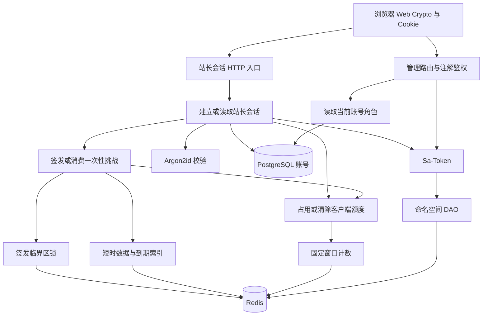
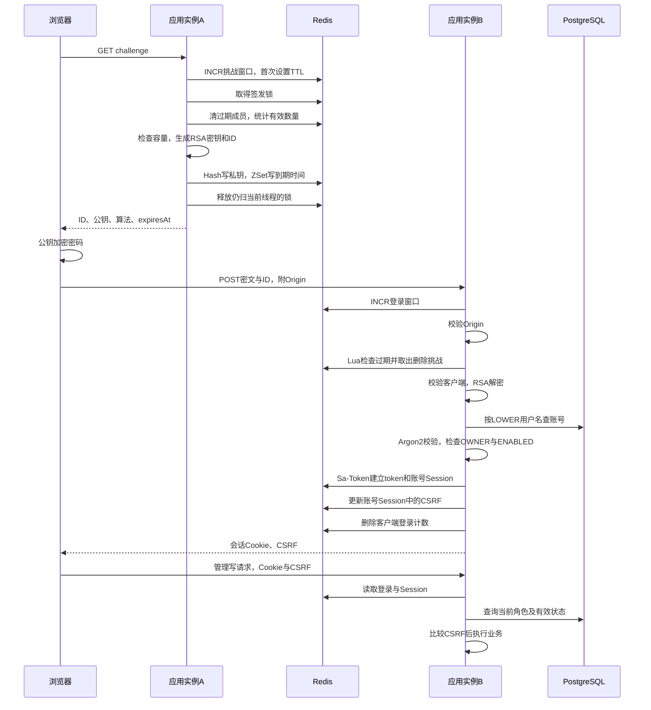
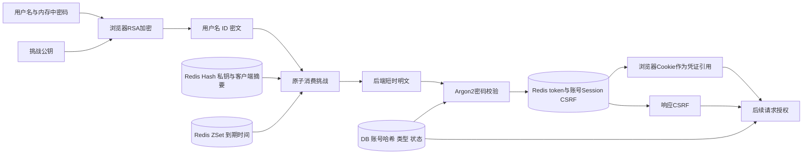
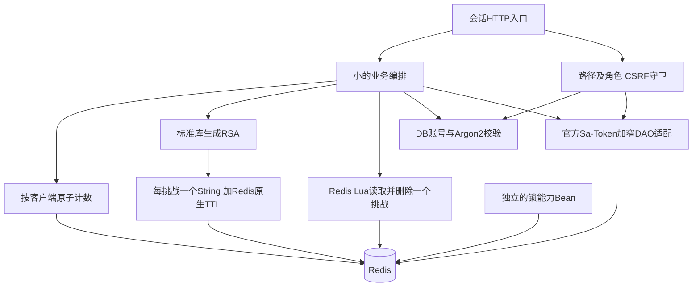

# Redis 鉴权基础设施 Learning Report

> 日期：2026-09-30（Asia/Shanghai）  
> 对应功能/里程碑：T076；关联 T010/T011、T074，不代表 T069 普通访客登录完成  
> Coding Agent Commit：基础设施 `473d090`，最近代码 `b5a07a1`；分析时 HEAD `15816077376bb754c77c26816c36063f38fa8410`  
> 相关 Spec：001-personal-portfolio 的 spec、tasks、plan、research、HTTP 合同、模块化架构决定及 PostgreSQL 迁移设计  
> Learning Agent：本轮只读分析；仅新增本报告，不修改实现、不运行连接外部服务的验收、不进入下一模块

使用实际存在的 `.agents/skills/learning-agent-skill/SKILL.md`、该目录下的手册与报告模板。用户提供的 `learning-agent/docs`、`learning-agent/templates` 路径不存在，实际文件在 `learning-agent-skill` 下。仓库内未找到生效的 AGENTS.md；constitution 仍是占位模板，不能当作已确定原则。

**证据规则**：[事实] 来自当前源码、配置、需求、依赖字节码或已有测试报告；[推断] 是由事实推出的条件性后果，未当成实际故障；[建议] 是待维护者判断的方案。章节 9、10、12、17、18 的设计内容均属建议。交接文档只用于定位；其中关于历史测试通过、原始用户追加要求的陈述不被升级为独立验收事实。

---

## 1. 一句话说明

[事实] 该模块让站长登录的**会话、尝试次数与一次性 RSA 挑战**由 Redis 统一保存，使不同应用实例可以访问同一认证状态，并提供限流、短时数据和锁能力；它不实现新的普通访客登录协议。[R1、B1、B2、B3]

[推断] 维护者最该掌握的不是 Redis API，而是三个边界：**谁决定权限、哪一步不可撤销、什么原子性只覆盖 Redis 内的一段操作**。当前必要的共享状态已建立，但严格容量、时钟、多次登录的 CSRF 行为和故障恢复尚未形成完整验收证据。

---

## 2. 分析边界

### 包含

- Redis/Redisson Starter：键生成、五段 Lua、限流、逐条 TTL 与消费、固定租期锁、条件装配。
- Security Starter：Sa-Token DAO 的命名空间与 TTL 适配、注解拦截器、密码哈希边界。
- 站长业务：申请挑战、密文登录、查会话、管理请求授权、CSRF、登出。
- 真实 Redis 测试、普通回归替身、站长安全测试、相关前端加密及请求测试。
- PostgreSQL `user_account`、运行配置、依赖版本、启动/验收脚本和旧映射格式的过渡。

### 不包含

- 普通账号注册/登录、博客导出、Agent、RAG、对象存储业务的完整学习周期。
- 新功能、实际重构、部署、Redis 服务配置修改或数据库数据修改。
- 把整个功能分支相对 main 的历史变化全部算成本轮 Redis 工作。
- 宣称多 JVM、Redis 3.2.1、Redis Cluster、主从切换或真实浏览器完整登录已验收。

[事实] 分析开始时已有未提交的 Launch POM 修改、未跟踪的学习技能目录和日志目录。当前工作区不是干净 checkout。本报告基于当前文件，不把历史测试报告视为该工作区此刻重跑的结果。

### 需求依据与冲突

| 依据 | 本轮采用的明确约束 | 证据状态 |
|---|---|---|
| FR-018/038/045 | 站长管理权限；NORMAL 不得取得管理权限 | [事实] spec 中明确存在 |
| T010/T011 | 一次性 RSA-OAEP、密文 POST、OWNER+ENABLED、Cookie、CSRF及测试 | [事实] tasks 中明确存在 |
| T076 | Redis/Redisson；键前缀与主体摘要；Redis 3.2 兼容 Lua；逐条 TTL、原子取出、锁、多实例共享；普通替身与显式验收 | [事实] tasks:215 明确存在并勾选 |
| 128挑战总容量、有效总数查询、锁等待/租期参数 | 当前实现的资源保护策略，不自动成为需求 | [事实] 可从代码/配置证明；无法从当前代码 / Spec 证明总容量是用户明确要求。T076没有明确写有效总数/128硬上限 |
| T074 与已接受的模块化架构决定 | 同 JVM 模块化单体、基础设施 Starter、三层、覆盖点、依赖方向 | [事实] 有独立设计依据；不等于每个小接口都必要 |
| Key/Lua 各集中一个文件 | 交接称来自用户补充；代码确实实现；规范要求 Key 集中生成 | [事实] 实现与规范可核对；本轮没有原始聊天，无法独立证明“各一个文件”的原始授权措辞 |
| plan/research/HTTP 合同 | 仍写首版不启用 Redis、单实例、私钥仅在 JVM 内存 | [事实] 与 T076 及代码冲突，不能同时满足 |
| tasks:11 | 站长流程暂不改为固定 SHA-256 摘要认证 | [事实] 前后端仍用 RSA，后端 Argon2；交接所述另一聊天决定无法独立核验 |
| 旧 data-model | MySQL/TINYINT 等历史描述 | [事实] 当前迁移 SQL、dev 配置与 PostgreSQL 迁移设计才反映当前账号存储 |

[建议] 本报告把 T076 与当前 tasks 边界视为较新的实现目标，并保留冲突，不私自改写 Spec。严格意义上，**无法设计一个同时满足“私钥仅 JVM 内存”与“Redis 多实例挑战”的方案**。章节 9 的“等价”限定于对齐后的、互不冲突的当前需求集合。

---

## 3. 当前实现事实

### 入口

[事实] 四个入口是 `GET /api/v1/admin/session/challenge`、`POST /api/v1/admin/session`、`GET /api/v1/admin/session`、`DELETE /api/v1/admin/session`。挑战响应设置 `Cache-Control: no-store`；客户端标识来自 `getRemoteAddr()`，缺失时使用 `unknown`，没有直接读取 X-Forwarded-For。[B4]

[事实] 登录请求字段为 `username/challengeId/encryptedPassword`；HTTP Bean Validation 先于 service。字段不合法的请求不一定进入登录计数。有效结构的请求先计数，再验 Origin，再消费挑战。不是“任何网络请求都被登录限流统计”。[B1、B4]

### 核心职责及真实存储

| 职责 | 当前实现 | 真正读写的状态 |
|---|---|---|
| 业务顺序 | AdminSessionServiceImpl | 读取账号；消费挑战；建立会话；写 CSRF；重置登录计数 |
| 签发和解密 | LoginChallengeServiceImpl | 创建 RSA-2048、24 字节随机 ID；Redis 保存客户端摘要+PKCS#8 私钥 Base64 |
| 配额规则 | LoginThrottleServiceImpl | 按客户端分别维护挑战申请窗口与登录窗口 |
| 共享计数 | RedissonFixedWindowRateLimiter | String 的 INCR 与首次 PEXPIRE；超额也继续计数 |
| 一次性数据 | RedissonExpiringStringMap | Hash 存 payload，ZSet 存到期毫秒；take/size 都可能删除数据 |
| 临界区 | RedissonDistributedLockService | Redisson 锁，等待 500ms/租期 10s 由挑战业务传入 |
| 会话适配 | NamespacedSaTokenDao | StringCodec、应用前缀、字符串更新保留 TTL；对象/Session 经依赖默认方法委托 |
| 权限复查 | AdminAuthorization、AccountRoleProvider、OwnerRoleServiceImpl | Cookie 识别登录；读取 DB 当前账号类型/状态；写请求比较 CSRF |

### 外部依赖与配置

[事实] BOM 固定 Spring Boot 4.1.1、Sa-Token 1.45.0、Redisson 4.7.0；根 POM 使用 Java 21。Security Starter 引入 Redis Starter、Sa-Token Boot4 与 Redisson DAO、Spring crypto、Bouncy Castle；Redis Starter 引入 Redisson Boot Starter。[C3]

[事实] Argon2PasswordHasher 固定参数 `(16,32,1,19*1024,2)`，不是直接 SHA-256 存密码；密码哈希来自 `user_account.password_hash`。登录读取关系库，没有在该登录方法中写账号表。初始化站长的事务与 PostgreSQL advisory lock 是其他行为，不应算成登录事务。[B1、C4]

| 配置 | 当前默认/行为 | 所在证据 |
|---|---|---|
| Redis 地址/database/超时 | 127.0.0.1:6379、0、连接/命令 3s；环境变量可覆盖 | C1 |
| 应用前缀 | `mai-portfolio`；REDIS_KEY_PREFIX 可覆盖 | C1、I2 |
| 挑战 | TTL 60s、未消费上限 128、单客户端 32 次/1m | C1 |
| 登录尝试 | 5 次/10m；成功删除该客户端窗口 | C1、B3 |
| 签发锁 | 等待 500ms、固定租期 10s；不在配置文件 | B2:43 |
| Origin | 精确匹配白名单；dev 默认 127.0.0.1:3000/9333 | C1、B1 |
| Cookie | portfolio_session；仅从 Cookie 读 token；HttpOnly、SameSite=Lax；基础 Secure=true、dev=false | C1 |
| 会话有效期等 | YAML 未显式设 timeout/is-concurrent/is-share | C1；依赖默认值见下 |

[事实] 本地 Sa-Token 1.45.0 字节码中 `SaTokenConfig()` 默认 timeout=2592000 秒、isConcurrent=true、isShare=false。它们是**未被其他设置覆盖时**的依赖默认值，不把它们当成部署时有效配置已核验。

[事实] `SecurityProperties` 对 Duration 只标 `@NotNull`；基础设施检查正值，但没有保证转换后毫秒数至少为 1，也没有集中验证超大 Duration。不能说所有非法 TTL 都在启动时被拒绝。[C2、I3、I4]

### Sa-Token 继承链的独立核验

[事实] 对本机实际依赖 JAR 执行只读字节码检查，确认：

```text
SaTokenDaoForRedisson 1.45.0
  implements SaTokenDaoByObjectFollowString
setObject -> serializer.objectToString -> this.set
getObject -> this.get -> serializer.stringToObject
updateObject -> this.update
deleteObject / getObjectTimeout / updateObjectTimeout -> 对应 String 方法
SaTokenDaoBySessionFollowObject
  setSession -> setObject(session.id, session, ttl)
  getSession -> getObject
  updateSession -> updateObject
StpLogic.getSession() -> getSession(true)
  -> getSessionByLoginId(getLoginId(), true)
StpLogic.getRoleList(id) -> 当前 StpInterface.getRoleList(id, loginType)
```

因此：对象/Session 的继承路径会落到本项目覆盖的 String 方法，**没有证据支持“对象因为没 override 就绕过前缀”这个猜测**；CSRF 的 `StpUtil.getSession()` 则是**账号 Session**，不是 Token-Session。当前角色读取路径调用 DB provider，没有自行实现 Redis 角色缓存。[D1、B5]

[推断] 同一账号再次登录会写同一账号 Session 的 CSRF 字段；旧浏览器拿着旧 CSRF 写操作可能失败。当前代码与依赖调用链支持这个推断，但没有双浏览器实测。不要把“每次登录生成 CSRF”解释成“每个 Cookie 都有独立 CSRF”。

### 测试证据的强度

本轮**阅读测试，没有重跑**。现存 surefire 报告只能说明留下来的历史运行记录。

| 证据 | 当前覆盖内容 | 当前证据不能证明 |
|---|---|---|
| RedissonIntegrationTest 两项 | 顺序限流、取出一次、一次真实锁调用；单条 100ms 数据等待 150ms 后 size=0 | 多客户端争用、窗口到期恢复、锁租期、混合 TTL、两个 JVM |
| DAO integration 两项 | String 读写/更新 TTL/搜索/超时修改/删除；List、SaSession 回读 | 自然到期；对象/Session 更新全契约；多前缀物理隔离；浏览器登录 |
| 锁 Mockito 两项 | 正常 unlock、tryLock=false 抛异常 | 真实争用、中断、归属变化、租约过期 |
| Challenge unit 两项 | RSA 解密、再次消费失败、错误客户端先消费 | 方法名虽写 outsideProcessMemory，替身实际为内存 HashMap，且不处理 TTL、没有真实锁 |
| Throttle unit 两项 | 委托、拒绝、reset | mock 预设返回值不证明窗口重置后真实行为 |
| AdminSecurityTest 四项 | 代码声明 Cookie/CSRF、RSA/拒明文、NORMAL/停用 OWNER、输入校验 | 当前报告四项均跳过；配置采用本地 Redis 替身，不是 DB+真 Redis 的完整链路 |
| BootContextSmokeTest 两项 | 当前报告两项成功；上下文和管理路由外的角色注解 | 数据库地址为不可用测试地址，Flyway/bootstrap 关闭；不是部署或真实登录验收 |
| 前端 crypto/session 测试 | Web Crypto 加密/解密、190 字节限制、请求只含三字段 | mock fetch，不证明浏览器 Cookie、代理身份、真后端协同 |

[事实] 当前留下的 Redis integration、DAO integration 报告各 2 项全部 skipped；相关 unit 报告有零失败、零跳过记录。交接称此前 3.2.100 上 4 项真实通过，但被后续普通回归覆盖。**无法从当前代码 / Spec 证明精确 Redis 3.2.1 已实测通过**，也无法仅凭当前 XML 独立重建那次成功。[T1–T6]

### 可追溯证据索引

正文使用这些编号，避免要求维护者逐文件平均阅读。链接指向当前工作区，行号是阅读入口。

| 编号 | 一手证据 |
|---|---|
| R1 | [tasks.md:215](F:/code/ai/codex/projects/mai-portfolio/specs/001-personal-portfolio/tasks.md:215)，T076；同文件 33/34 为 T010/T011，213 为 T074 |
| R2 | [spec.md:179](F:/code/ai/codex/projects/mai-portfolio/specs/001-personal-portfolio/spec.md:179)，FR-018；FR-038/045 位于 199/206 |
| R3 | [模块化架构:53](F:/code/ai/codex/projects/mai-portfolio/specs/001-personal-portfolio/modular-backend-architecture.md:53)，[代码规范:1172](F:/code/ai/codex/projects/mai-portfolio/specs/001-personal-portfolio/springboot-nuxt-code-style.md:1172) |
| R4 | [HTTP 合同:7](F:/code/ai/codex/projects/mai-portfolio/specs/001-personal-portfolio/contracts/http-api.md:7)，[plan:19](F:/code/ai/codex/projects/mai-portfolio/specs/001-personal-portfolio/plan.md:19)，[research:21](F:/code/ai/codex/projects/mai-portfolio/specs/001-personal-portfolio/research.md:21) |
| B1 | [AdminSessionServiceImpl:72](F:/code/ai/codex/projects/mai-portfolio/backend/mai-portfolio-modules/mai-portfolio-module-system/mai-portfolio-module-system-service/src/main/java/dev/amai/portfolio/system/service/impl/AdminSessionServiceImpl.java:72) |
| B2 | [LoginChallengeServiceImpl:73](F:/code/ai/codex/projects/mai-portfolio/backend/mai-portfolio-modules/mai-portfolio-module-system/mai-portfolio-module-system-service/src/main/java/dev/amai/portfolio/system/service/impl/LoginChallengeServiceImpl.java:73)，消费在 87，创建在 125 |
| B3 | [LoginThrottleServiceImpl:29](F:/code/ai/codex/projects/mai-portfolio/backend/mai-portfolio-modules/mai-portfolio-module-system/mai-portfolio-module-system-service/src/main/java/dev/amai/portfolio/system/service/impl/LoginThrottleServiceImpl.java:29) |
| B4 | [AdminSessionController:59](F:/code/ai/codex/projects/mai-portfolio/backend/mai-portfolio-modules/mai-portfolio-module-system/mai-portfolio-module-system-service/src/main/java/dev/amai/portfolio/system/controller/AdminSessionController.java:59)，客户端标识在 124 |
| B5 | [AdminAuthorization:25](F:/code/ai/codex/projects/mai-portfolio/backend/mai-portfolio-modules/mai-portfolio-module-system/mai-portfolio-module-system-service/src/main/java/dev/amai/portfolio/system/auth/AdminAuthorization.java:25)，[OwnerRoleServiceImpl:21](F:/code/ai/codex/projects/mai-portfolio/backend/mai-portfolio-modules/mai-portfolio-module-system/mai-portfolio-module-system-service/src/main/java/dev/amai/portfolio/system/service/impl/OwnerRoleServiceImpl.java:21) |
| I1 | [RedisLuaScripts:14](F:/code/ai/codex/projects/mai-portfolio/backend/mai-portfolio-framework/mai-portfolio-spring-boot-starter-redis/src/main/java/dev/amai/portfolio/redis/define/RedisLuaScripts.java:14)，MAP_PUT/TAKE/SIZE/KEEP_TTL 分别从 27/47/65/78 开始 |
| I2 | [RedisKeys:18](F:/code/ai/codex/projects/mai-portfolio/backend/mai-portfolio-framework/mai-portfolio-spring-boot-starter-redis/src/main/java/dev/amai/portfolio/redis/define/cache/RedisKeys.java:18) |
| I3 | [RedissonExpiringStringMap:28](F:/code/ai/codex/projects/mai-portfolio/backend/mai-portfolio-framework/mai-portfolio-spring-boot-starter-redis/src/main/java/dev/amai/portfolio/redis/store/RedissonExpiringStringMap.java:28) |
| I4 | [RedissonFixedWindowRateLimiter:24](F:/code/ai/codex/projects/mai-portfolio/backend/mai-portfolio-framework/mai-portfolio-spring-boot-starter-redis/src/main/java/dev/amai/portfolio/redis/rate/RedissonFixedWindowRateLimiter.java:24) |
| I5 | [RedissonDistributedLockService:25](F:/code/ai/codex/projects/mai-portfolio/backend/mai-portfolio-framework/mai-portfolio-spring-boot-starter-redis/src/main/java/dev/amai/portfolio/redis/lock/RedissonDistributedLockService.java:25) |
| I6 | [NamespacedSaTokenDao:27](F:/code/ai/codex/projects/mai-portfolio/backend/mai-portfolio-framework/mai-portfolio-spring-boot-starter-security/src/main/java/dev/amai/portfolio/security/session/NamespacedSaTokenDao.java:27) |
| I7 | [Redis 自动配置:18](F:/code/ai/codex/projects/mai-portfolio/backend/mai-portfolio-framework/mai-portfolio-spring-boot-starter-redis/src/main/java/dev/amai/portfolio/redis/autoconfigure/RedisInfrastructureAutoConfiguration.java:18)，[Security 自动配置:18](F:/code/ai/codex/projects/mai-portfolio/backend/mai-portfolio-framework/mai-portfolio-spring-boot-starter-security/src/main/java/dev/amai/portfolio/security/SecurityAutoConfiguration.java:18) |
| C1 | [application.yml:36](F:/code/ai/codex/projects/mai-portfolio/backend/mai-portfolio-launch/src/main/resources/application.yml:36)，[application-dev.yaml:29](F:/code/ai/codex/projects/mai-portfolio/backend/mai-portfolio-launch/src/main/resources/application-dev.yaml:29) |
| C2 | [SecurityProperties:13](F:/code/ai/codex/projects/mai-portfolio/backend/mai-portfolio-modules/mai-portfolio-module-system/mai-portfolio-module-system-service/src/main/java/dev/amai/portfolio/system/config/SecurityProperties.java:13) |
| C3 | [dependencies POM:12](F:/code/ai/codex/projects/mai-portfolio/backend/mai-portfolio-dependencies/pom.xml:12)；Redis/Security Starter POM |
| C4 | [PostgreSQL SQL:7](F:/code/ai/codex/projects/mai-portfolio/backend/mai-portfolio-launch/src/main/resources/db/postgresql/V1__portfolio_and_document_core.sql:7)，[Argon2PasswordHasher:7](F:/code/ai/codex/projects/mai-portfolio/backend/mai-portfolio-framework/mai-portfolio-spring-boot-starter-security/src/main/java/dev/amai/portfolio/security/password/Argon2PasswordHasher.java:7) |
| T1 | [RedissonIntegrationTest:81](F:/code/ai/codex/projects/mai-portfolio/backend/mai-portfolio-framework/mai-portfolio-spring-boot-starter-redis/src/test/java/dev/amai/portfolio/redis/integration/RedissonIntegrationTest.java:81) |
| T2 | [NamespacedSaTokenDaoIntegrationTest:54](F:/code/ai/codex/projects/mai-portfolio/backend/mai-portfolio-framework/mai-portfolio-spring-boot-starter-security/src/test/java/dev/amai/portfolio/security/session/NamespacedSaTokenDaoIntegrationTest.java:54) |
| T3 | [LoginChallengeServiceImplTest:34](F:/code/ai/codex/projects/mai-portfolio/backend/mai-portfolio-modules/mai-portfolio-module-system/mai-portfolio-module-system-service/src/test/java/dev/amai/portfolio/system/service/impl/LoginChallengeServiceImplTest.java:34) |
| T4 | [RedisTestConfiguration:65](F:/code/ai/codex/projects/mai-portfolio/backend/mai-portfolio-launch/src/test/java/dev/amai/portfolio/RedisTestConfiguration.java:65)，[测试配置:13](F:/code/ai/codex/projects/mai-portfolio/backend/mai-portfolio-launch/src/test/resources/application.yaml:13) |
| T5 | [AdminSecurityTest:35](F:/code/ai/codex/projects/mai-portfolio/backend/mai-portfolio-launch/src/test/java/dev/amai/portfolio/AdminSecurityTest.java:35)，[BootContextSmokeTest:24](F:/code/ai/codex/projects/mai-portfolio/backend/mai-portfolio-launch/src/test/java/dev/amai/portfolio/BootContextSmokeTest.java:24) |
| T6 | 当前各模块 `target/surefire-reports/TEST-*.xml`；不入 Git、可被覆盖，本轮只读取 suite 摘要 |
| F1 | [前端 session.ts:21](F:/code/ai/codex/projects/mai-portfolio/frontend/app/api/session.ts:21)，[loginCrypto.ts:5](F:/code/ai/codex/projects/mai-portfolio/frontend/app/api/loginCrypto.ts:5) 及相邻测试 |
| D1 | 本地 `D:/dev/maven/maven3.9.8-repository/cn/dev33/sa-token-{core,redisson}/1.45.0/` 中实际 JAR；以 javap -c -p 查看本节列出的类/方法；升级后需重验 |
| P1 | [test-redis.ps1](F:/code/ai/codex/projects/mai-portfolio/backend/test-redis.ps1)，[run-local.ps1](F:/code/ai/codex/projects/mai-portfolio/backend/run-local.ps1) |

---

## 4. 核心业务链路

### 模块结构与调用方向



[事实] 自动装配顺序为 Redisson Boot4 → Redis 基础设施 → Security DAO → 业务服务。普通测试排除 Redisson 自动配置并提供本地替身，不经过生产 Redis 链路。[I7、T4]

### 一条完整主链路：从挑战到可写管理请求



图中的 A/B 表示源码允许不同实例使用共享状态，**不表示已经跨 JVM 实测成功**。不画一个包住全部步骤的事务框，因为代码没有这种事务。[B1、B2、I1]

### 失败路径插入点

- [事实] 挑战限流失败 → 429；锁等待失败/容量满 → 429；已经占用的挑战额度不退回。
- [事实] 输入校验失败 → 不进入 service；Origin 不匹配 → 登录额度已占用，但挑战尚未消费。
- [事实] 挑战过期、已消费或绑定错误 → 422；错误绑定也先删除挑战。坏 Base64、错误长度/OAEP/UTF-8 不恢复挑战。
- [事实] 密码错误 → 401；非 OWNER 或停用 → 403；这些检查发生在挑战已消费之后。
- [事实] Redis、DB、解密设施异常不由该流程做补偿。项目 Web 异常层负责 HTTP 外壳，不因此回滚前面的 Redis 写入。
- [推断] 已创建 token 后写 CSRF/reset 失败，客户端可能收到失败，而后台已有部分会话状态；响应丢失时即使服务器全部成功，客户端仍可能不知道结果。

---

## 5. 数据与状态变化

### Source of Truth 与数据流



[事实] DB 决定账号身份、密码哈希、类型和有效状态；Redis 决定当前运行中的 token/Session、挑战和计数。浏览器 Cookie 是引用，不是 OWNER 权限真源；公钥/响应 expiresAt 是客户端信息，不是消费时的有效性真源。

**应维持的不变量**：同一 challengeId 在 Hash 与 ZSet 的成员集合一致；有效挑战要求 payload 存在且 score 大于校验时刻；消费最多返回一次有效 payload。`size()` 实际以清理后的 ZCARD 为准，不验证 Hash 中每个 payload 是否存在。[I1]

容器 TTL 只负责整个 Hash/ZSet 的回收，ZSet score 负责成员有效性，二者不是同一件事。当前写入先算 JVM epoch 到期时间，再让 Redis 按相对 TTL 回收容器；多实例时钟偏差没有由 Lua 消除。[I3]

令 P 为应用前缀，H 为 SHA-256 十六进制摘要：

| 状态 | Redis 形态或 DB 真源 | 生命周期 |
|---|---|---|
| 挑战申请计数 | `P:rate:auth:challenge:H(client)` String | 首次请求起 1m；后续不延长 |
| 登录计数 | `P:rate:auth:login:H(client)` String | 首次请求起 10m，成功主动删除 |
| 挑战 payload | `P:map:auth:login:challenge:data` Hash，field=ID | value=客户端指纹`.`私钥 Base64；消费删除 |
| 挑战过期 | `P:map:auth:login:challenge:expires` ZSet，member=ID | score=JVM epoch 毫秒；size/take 清理；容器也有 TTL |
| 签发锁 | `P:lock:H(auth-login-challenge-issue)` | Redisson 管理租约和所有者 |
| 会话 | `P:sa-token:<原始键>` | Sa-Token 的 timeout、对象/Session 委托决定 |
| 账号 | `user_account`，LOWER(username) 唯一索引 | 长期 DB 事实；本次登录只读 |

### 状态变化表

| 时机 | 数据/状态变化 | Source of Truth | 修改位置 | 失败后状态 | 可重试 |
|---|---|---|---|---|---|
| 申请挑战 | 计数+1，首项设 TTL | Redis计数 | RATE_ACQUIRE | 后续失败仍计数 | 重试是新申请，不幂等 |
| 获取签发锁 | 无锁→有租约 | Redis锁 | tryLock | 等待失败不进入创建；额度已用 | 可以新申请，但仍计数 |
| 容量检查 | 清过期成员；读取有效数 | Hash/ZSet约定 | MAP_SIZE | 清理已发生，不随RSA失败恢复 | 可再检查；不是纯读 |
| 发布挑战 | 无→ACTIVE，写私钥/到期索引 | Redis映射 | MAP_PUT | 响应丢失时挑战可能已存储 | 新签发会创建另一条 |
| 时间到达 | ACTIVE→逻辑EXPIRED | score+校验时钟 | take/size，或容器回收 | 过期私钥可能仍在Hash，直到清理/回收 | 需新挑战 |
| 提交登录 | 登录计数+1 | Redis计数 | 登录第一步 | Origin失败也保留计数 | 重试继续计数 |
| 消费挑战 | ACTIVE→CONSUMED；过期项清除 | Redis映射 | MAP_TAKE | 拿到后解密/DB失败不恢复；回复丢失拿不到私钥 | 不可重放同一挑战 |
| 校验账号 | DB无写入 | PostgreSQL | 查询+Argon2+类型检查 | 挑战已耗尽、额度已用 | 新挑战后再尝试 |
| 建立会话 | token/Session 创建或更新 | Redis会话 | StpUtil.login | 后续失败不做业务回滚 | 不能盲重放旧POST |
| 写CSRF | 账号Session字段被新值覆盖 | Redis账号Session | getSession().set | token可能已存在；旧客户端令牌可能过时 | 查询当前会话/重新登录策略需明确 |
| 成功清计数 | String→不存在 | Redis计数 | reset/delete | 失败时登录可能已成立，计数仍存在 | 删除本身可重复，但整次登录不幂等 |
| 管理请求 | 读取token、DB角色、CSRF | Redis+DB各自事实 | 路由/注解/provider | DB/Redis不可用不应自行放行 | 读取可重试；业务写另外判断 |
| 登出 | token/Session相关状态删除或更新 | Redis会话 | StpUtil.logout | 部分执行/响应丢失需查询；已登出后重复DELETE可能401 | 状态目标可重复，HTTP响应未必相同 |

### 必须明确的技术边界

| 边界 | 事实与限制 |
|---|---|
| 事务 | 登录无 @Transactional、无跨库事务；单 Lua 防命令交错，不能包住RSA、DB、Sa-Token多个调用。Lua运行错误也不能被理解为自动回滚已写入命令。见 [Redis 官方说明](https://redis.io/blog/you-dont-need-transaction-rollbacks-in-redis/) |
| 并发 | 当前 size→RSA→put 靠全局锁；take 靠 Lua。锁到期后旧线程仍可能继续运行，finally检查所有者只防错误释放，不能阻止旧业务写入 |
| 幂等 | take 是最多消费一次；重复返回空，不是返回同一成功结果。INCR、签发、登录不具备请求级幂等键 |
| 缓存 | 没有 DB 读缓存/双删/Caffeine；认证状态丢失会影响登录、权限凭证与限流。不能套“缓存故障忽略”的策略 |
| 时间 | 成员时间由各 JVM 提供；容器 TTL 由 Redis 执行。响应 expiresAt 的计算又早于实际存储，不能用响应时间代替真实消费检查 |
| 异步 | 该业务没有 @Async、调度清理或 MQ；请求同步等待存储。Redisson 网络/定时线程是客户端内部实现，不是业务最终一致性机制 |
| 权限 | token确认登录，DB复查OWNER+ENABLED；Origin用于登录，CSRF用于后续非GET/HEAD/OPTIONS管理请求；各自目的不同 |
| 外部副作用 | Redis写/删/TTL/锁、Set-Cookie、会话CSRF、审计日志；登录路径无DB账号写入、无OSS/MQ副作用 |
| 重试 | 项目没有业务重试循环；底层命令重试是否发生、发生几次不能从这些方法证明。写入已执行但返回超时属于不确定结果 |

[推断] Hash/ZSet 被单独淘汰、类型被其他写入破坏或 Lua 中途报错会破坏成员一致性；size 可能算入无 payload 的索引。当前代码没有修复/校验两者差异的流程。这不是已实测出现的故障。

---

## 6. 最小功能单元

| # | 业务行为 | 输入→输出 | 状态变化 | 依赖 | 风险 | 学习优先级 |
|---|---|---|---|---|---|---|
| 1 | 接收合法登录字段 | HTTP→验证后的三字段 | 无业务写 | MVC/Validation | 低，协议边界需扫一遍 | 知道作用 |
| 2 | 判断客户端申请额度 | 客户端→允许/429 | Redis计数+TTL | Lua/Redis | 高 | 重点 |
| 3 | 检查未消费挑战容量 | 命名空间→有效数/429 | 清过期、申请锁 | 锁/Hash/ZSet | 高 | 重点 |
| 4 | 签发一次性公钥 | 客户端→ID、公钥、到期提示 | 保存私钥与到期索引 | JCE/Redis | 高 | 理解生命周期 |
| 5 | 客户端加密并提交 | 公钥+密码→密文POST | 浏览器临时字节 | Web Crypto | 中 | 理解协议，不学算法实现 |
| 6 | 检查来源和登录额度 | Origin+客户端→继续/拒绝 | 先计数，Origin失败不回滚 | 配置/Redis | 高 | 重点顺序 |
| 7 | 消费并解密 | ID+客户端+密文→短时密码 | 先删后校验 | Lua/JCE | 高 | 重点 |
| 8 | 核验站长资格 | 用户名+密码→账号/401/403 | DB只读 | PostgreSQL/Argon2 | 高 | 重点真源 |
| 9 | 建立可用于管理的会话 | 账号→Cookie、CSRF | token/账号Session/计数多步变动 | Sa-Token/Redis | 高 | 重点部分失败 |
| 10 | 查询会话/复查资格 | Cookie→当前状态 | 通常读；账号消失的分支可logout | Redis/DB | 高 | 理解调用关系 |
| 11 | 管理写请求防跨站 | Cookie+CSRF→放行/拒绝 | 本鉴权模块不写业务表 | 拦截器/角色provider | 高 | 重点 |
| 12 | 登出 | Cookie+CSRF→清会话 | 删除/更新会话 | Sa-Token | 高 | 理解scope和失败 |
| 13 | 组装基础设施 | 配置+依赖→Bean | 连接/线程资源 | Boot/Redisson | 中 | 抽查条件装配 |
| 14 | 隔离验收数据 | 环境/UUID→测试结果 | 写删随机空间 | 脚本/真Redis | 中 | 知道与普通测试的区别 |

---

## 7. 风险分级

### 高风险：先把注意力给这六处

1. **B1 登录 72–101 行**：画出每个失败点之前已经发生的写入；辨认 DB 权限真源、账号 Session 与 token 的区别。理解时间优先于阅读样板。
2. **B2 消费 87–118 行**：为什么先删、错误客户端为何也耗尽；“一次性”不承诺用户一定拿到结果。
3. **I1 三段 MAP Lua + I3**：成员/容器双重过期、Hash/ZSet不变量、size有副作用、JVM时间；验证短成员在长容器内的失效。
4. **B2 签发 125–142 + I5**：容量检查与插入是否一个原子动作；固定租期为什么限制128硬上限的证明。
5. **I6 + B5**：String/对象/Session委托、TTL保存、角色实时复查、CSRF scope和停用后的请求。
6. **I1 RATE + B3**：窗口起点、超额递增、成功reset与并发失败的交错、代理/NAT的身份粒度。

### 中风险：理解关系，再挑边界抽查

- I2 Key格式与迁移：谁共享同一前缀、动态主体为何摘要、旧数据如何过渡。
- I7 自动配置与POM：生产使用哪些 Bean，替身为何能覆盖，缺Redis时为何不能当成降级。
- RSA编码/解码、前端参数对应：OAEP的MGF1 SHA-256、SPKI/PKCS#8、190字节边界。
- P1 `.env` 注入脚本：配置优先级、Java版本检查、真实验收条件及清理范围。
- T1/T2真实测试及日志脱敏调用：别把测试方法名和BUILD SUCCESS当作真实边界证据。

### 低风险：快速略读

- VO/ApiVo、响应包装、OpenAPI说明、普通Service接口声明、常量提示和包/资源登记。
- Mapper继承语法、构造器注入、基础配置绑定样板。

低风险的是样板，**字段白名单、SQL条件、配置有效性与装配优先级仍是审查点**。建议阅读顺序：B1→B2消费→I1/I3→I5→B5/I6→测试对照；不要从所有POM开始。

---

## 8. 架构审讯

本节各项均回答：为何存在、需求依据、删除后果、最简替代、额外能力、成本是否值得、开源来源、未来预留。结论是有条件的判断，不是重构指令。

### 8.1 Redis共享认证状态与Redisson边界

- **为什么存在**：[事实] 跨实例访问会话、计数和挑战；提供锁。[R1]
- **当前需求依据**：T076明确要求Redis/Redisson与多实例消费，不是从延迟指标推导的性能缓存。
- **删除会导致**：改成本地内存会失去跨进程共享，违背T076；换其他客户端也违背当前已选技术。
- **最简单替代**：保留一个RedissonClient和少数窄操作，直接委托官方能力。
- **当前额外解决**：统一前缀/摘要、三种业务所需原子语义、旧服务端适配。
- **新增成本/是否值得**：[推断] Redis故障面、部署和敏感状态保护是实质成本；共享状态需求已明确，组件本身有依据，但持久性和高可用不能顺带宣称。
- **开源结构**：项目分层参考orion有文档证据；不能证明采用Redis只是模仿开源。
- **未来预留**：通用复用有预留；当前登录已真实使用，不是纯未来设施。
- **结论**：共享状态为必要复杂度；未要求的集群/缓存框架应留空。

### 8.2 三个基础设施Interface及实现

- **为什么存在**：[事实] FixedWindowRateLimiter、ExpiringStringMap、DistributedLockService隔离业务和Redisson，普通测试可替换。[T4]
- **需求依据**：T074基础设施边界和覆盖点，T076普通回归不依赖真Redis。
- **删除会导致**：直接写Redisson仍能满足业务；删除测试隔离能力则破坏普通回归约束。接口类型本身并非唯一解。
- **最简单替代**：少量具体Bean；或一个明确的认证状态端口配内存/Redis实现，不制造通用仓储层。
- **额外能力**：窄契约、测试替身、集中实现；当前生产实现各只有Redisson一种。
- **成本/是否值得**：接口让副作用容易定位，成本小，合理；但put/size的组合不能表达原子容量约束，不能因“有接口”就认为契约完整。替身也不等价于生产。
- **开源结构**：没有证据证明这三个接口逐字照搬参考项目。
- **未来预留**：未来锁/映射使用者无法从当前调用点证明；不据此继续扩充通用接口。
- **结论**：已有外部边界和替身需求使接口可保留；“所有业务都复用”是待证明复杂度。

### 8.3 短时映射Hash+ZSet+三段Lua

- **为什么存在**：[事实] 有效数量、逐条失效、原子消费需要一致的状态读取/修改；旧版本本项目使用RMapCache.size/remove，当前已替换。
- **需求依据**：T076逐条TTL/原子取出；容量阈值只由C1/B2确认是实现策略。T076没有明确要求有效总数或128硬上限；不能采用handoff的归因作为补出的需求。
- **删除会导致**：只用Hash不能表达逐条TTL；只用ZSet没有私钥值；简单GET后DEL会暴露消费竞争。
- **最简单替代**：无总容量要求时单项String+TTL+GET/DEL Lua；有当前容量要求时仍需有效索引或原子容量模型。不能把单String方案称为完整等价。
- **额外能力**：按到期时间清理、有效数量查询、双结构同段操作；无需等后台清理才判断失效。
- **成本/是否值得**：需要两结构不变量、两种TTL和时钟；若保留当前容量策略，它有相应收益；只有逐条TTL/原子取出需求时，单String也能做到，双结构必要性不能证明。size清理all expired会放大脚本耗时。
- **开源结构**：从当前代码/Spec无法证明该算法只是照搬参考项目。
- **未来预留**：namespace通用化超出单登录调用，收益尚未体现；不宜增加通用索引恢复框架。
- **结论**：TTL/原子消费有必要性；Hash+ZSet+有效总数属于依赖容量策略的待证明复杂度。先确认保护要求，边界验证不足不等于结构应立刻删除。

### 8.4 Lua作为一致性边界

- **为什么存在**：[事实] INCR+首次TTL、取出删除、清理统计、更新保留TTL均需多个命令共同观察状态。
- **需求依据**：T076明确原子与Redis3.2兼容；替换GETDEL/KEEPTTL等新命令不能假装保持旧兼容。
- **删除会导致**：拆成客户端多请求会留下计数无TTL、重复取出、TTL重置等交错机会。
- **最简单替代**：每个不变量一段短脚本；无需再加脚本注册器/解析器/DSL。
- **额外能力**：本地于Redis的无交错状态变化、较少往返。
- **成本/是否值得**：参数顺序、类型、时间单位和错误前副作用必须验证；短脚本成本值得。Lua不买来跨库事务，也不买来自动回滚。
- **开源结构**：使用Redis原生命令组合不等同于复制开源分层，来源无法证明。
- **未来预留**：当前5段都有调用；没有发现备用自定义脚本框架。
- **结论**：必要机制；不应包装成自定义框架。

### 8.5 全局签发锁与Supplier执行包装

- **为什么存在**：[事实] 当前容量读取、RSA生成、插入是三个阶段，用锁让正常情况下size→put串行。
- **需求依据**：T076需要锁能力，但未要求挑战必须使用全局锁或把RSA放入临界区。
- **删除会导致**：若仍保留size后put，两个线程都可能读到127再各写一条。
- **最简单替代**：RSA在外生成，最终用一段Lua清理→比较容量→条件插入；锁能力作为T076交付保留，但该链路不必调用它。
- **额外能力**：容量满时不生成RSA，限制正常签发的并行CPU；统一finally释放。
- **成本/是否值得**：全局串行、固定租期、失锁后继续写、等待429；相较原子条件插入收益有限。是否需要“全局RSA并发上限”没有明确需求/压测证据。
- **开源结构**：无法证明为参考项目结构照搬。
- **未来预留**：common放锁抽象有明确架构决定，当前实际业务调用只有挑战；其他域复用尚未证明。
- **结论**：当前多步骤必须互斥或改原子动作；具体长临界区是过度设计候选/简化候选，不能直接拔掉锁。

### 8.6 Key集中定义与摘要

- **为什么存在**：[事实] 三类基础设施和Sa-Token共同遵守前缀，避免拼接散落；主体SHA-256避免直接把IP放键上。[I2]
- **需求依据**：T076与代码规范；“各单文件”还有交接记录，原始用户语句无法本轮独立证明。
- **删除会导致**：若删集中入口而复制拼接，会增加键冲突/迁移差异；删除业务常量不必删除统一格式。
- **最简单替代**：一个配置前缀+几个纯生成函数；当前RedisKeys已接近该形态。
- **额外能力**：namespace校验、动态主体格式统一、Sa-Token包装/解包。
- **成本/是否值得**：收益足以支持小入口；auth命名空间放通用Starter使基础设施知道业务，后续扩大时需限制。
- **开源结构**：define/cache约定的来源文档明确来自orion；实际没有引入其CacheKeyBuilder等完整结构。
- **未来预留**：集中文件成长可能有问题，当前无需加Registry。SHA-256摘要不是加密，低熵IP也不能因此被宣称不可推回。
- **结论**：必要的格式约束；业务常量位置为可接受取舍，跨域无限增长待证明。

### 8.7 Lua常量单文件

- **为什么存在**：[事实] 五段脚本集中便于追踪参数契约、共享TTL更新逻辑。[I1]
- **需求依据**：交接记录用户补充；代码规范要求统一Key，不直接证明Lua必须单Java文件。
- **删除会导致**：分散复制脚本可能漂移；移为.lua资源不损失业务能力。
- **最简单替代**：当前文本块与调用参数说明；或少量.lua资源，二者都无需加载框架。
- **额外能力**：Java编译产物携带脚本，无独立资源路径；减少重复。
- **成本/是否值得**：编辑/诊断Lua工具较少；当前规模成本小，值得保留集中定位。
- **开源结构**：无法从当前代码/Spec证明来自参考项目。
- **未来预留**：无Registry/版本分发框架，当前不过度；未来不得为单文件变大自动加框架。
- **结论**：小规模工程组织，不是必须重点学习的架构模式。

### 8.8 Sa-Token继承式DAO Adapter

- **为什么存在**：[事实] 对第三方会话存储协议补前缀、StringCodec和旧Redis TTL语义。[I6、D1]
- **需求依据**：T076命名空间、Redis3.2兼容和会话迁移。
- **删除会导致**：恢复原DAO会失去应用前缀；本地原1.45 update通过getTimeout再set，无法等同本项目毫秒级原子保TTL。
- **最简单替代**：只实现String窄契约并复用已验证的对象/Session委托；或小的组合Adapter。重新实现全部会话不是简化。
- **额外能力**：保留官方序列化与Session契约；避免为对象重复写前缀逻辑。
- **成本/是否值得**：依赖默认方法隐含调用路径，升级可能变化；当前继承减少代码而非明显过度，必须锁定契约测试。
- **开源结构**：该继承由实际第三方适配器边界决定，不能用orion来源解释。
- **未来预留**：无多套会话策略；注释“角色缓存”不证明当前角色结果缓存。
- **结论**：必要适配，当前扩展方式可保留；不建议仅为回避继承就新增多层Adapter。

### 8.9 Service接口/实现与多段编排

- **为什么存在**：[事实] 业务拆为会话编排、挑战、配额、角色；三层和接口/impl是明确项目约定。[R3]
- **需求依据**：T074、PostgreSQL迁移设计与代码规范支持三层；未逐个要求每个两行转发都必须单独抽象。
- **删除会导致**：删全部Service把业务放Controller违背约定；合并纯委托接口不必损失业务能力，但需先确认规则可调整。
- **最简单替代**：保持三层；一个会话编排service加小挑战组件、少量私有配额方法；角色provider直接做窄账号查询。
- **额外能力**：挑战可单测、配额行为统一、角色查询独立；目前这些Service生产都单实现。
- **成本/是否值得**：会话/挑战职责分开有实质收益；Throttle/OwnerRole的双层转发主要买来组织和mock便利，收益较小。
- **开源结构**：provider/service与interface/impl约定有参考orion的文档证据；无法证明每层仅为模仿。
- **未来预留**：普通访客登录明确在T069，但尚不能证明复用当前OWNER流程正确。不得为未来注册预先加Strategy/Factory。
- **结论**：业务职责分离有依据；薄接口属于可接受工程约定或待证明复杂度，暂不优先重构。

### 8.10 Spring Boot Starter与条件自动配置

- **为什么存在**：[事实] 隔离第三方依赖、装配客户端后装配项目能力、允许测试Bean替换。[I7]
- **需求依据**：T074与已接受模块化决定直接指定。
- **删除会导致**：简单@Configuration也能执行业务，但违反当前模块约定，依赖再次散入service。
- **最简单替代**：两个现有Starter加官方配置和项目窄Bean，不增加第五层插件装配。
- **额外能力**：POM依赖所有权、ConditionalOnMissingBean、自动配置先后顺序、测试运行隔离。
- **成本/是否值得**：必须理解“同JVM模块化单体”与“分布式共享状态”并不冲突；注解装配出错会启动失败。已确认架构下可以保留，不能仅凭业务模块变多就新增Starter。
- **开源结构**：参考orion结构有事实依据；当前又有独立accepted决定，不能一概视为无依据模仿。
- **未来预留**：Agent/Blog边界已确认；未实现API和未来运行设施不纳入本轮必要性证明。
- **结论**：当前约定下必要；它解决依赖组织，不解决登录原子性。

### 8.11 权限中间件、账号Session、RSA与密码接口

- **为什么存在**：[事实] 路由兜底保护admin，SaInterceptor实现注解，角色provider把DB事实交给库；RSA实现现存密文协议，PasswordHasher封装Argon2。
- **需求依据**：T010/T011、FR-018/038/045；T074日志/安全Starter边界。
- **删除会导致**：只靠某几个注解可能遗漏管理路由；只做登录不复查DB会接受停用账号；只用Cookie且无CSRF不满足写请求约束；取消RSA直接改变已确认请求协议。
- **最简单替代**：一个路径守卫+官方角色接口；Cookie/CSRF按明确scope保存；RSA继续JCE/Web Crypto；Hasher只需encode/matches。
- **额外能力**：两道授权覆盖不同入口、统一错误、可替换密码实现；并没有自定义RBAC/认证框架。
- **成本/是否值得**：保护边界值得保留；路由与注解可能重复DB角色查询，但不能仅据此删防线。账号级CSRF是否符合意图待确认；RSA不替代HTTPS，其传输收益与额外私钥存储应独立评价。
- **开源结构**：框架协议有明确需求，无法证明只为模仿参考项目。
- **未来预留**：PasswordHasher有测试隔离意义，不需加哈希Factory；多账号类型不等于已需要RBAC。
- **结论**：安全机制必要；当前CSRF scope和RSA存储范围需对齐，而不是再加安全框架。

### 8.12 本轮不存在的机制

[事实] 本轮相关生产代码没有Factory、Registry、应用层Strategy选择器、Pipeline框架、事件总线、MQ、@Async、自定义调度清理、多级Cache或自定义认证框架。接口实现可被视为可替换端口，但没有运行时策略注册。连续方法调用不是Pipeline框架；Redisson内部网络线程、锁通知和Lua不等于项目新增MQ/Event。

[建议] 当前没有需求证明这些机制应新增；删除它们没有问题，因为本轮没有它们。学习时不需要为不存在的层补课，也不要为了“解耦”引入它们。

---

## 9. 最小等价方案

**[建议] 先列必须保持的行为，再选数据操作；不以当前目录为设计输入。**

### 9.1 只满足已确认需求的最小方案

当前一致的需求集合：站长与普通类型隔离；现有RSA请求协议及安全密码哈希；Origin、Cookie、CSRF；Redis/Redisson、应用命名空间/摘要；共享会话、原子固定窗口、逐条TTL与一次性消费；通用锁能力；Starter与三层；普通替身/真实验收。Argon2保留既有兼容。Key/Lua集中继续保留组织约定。

**这里没有把128总容量、有效总数、全局签发锁、10s租期当成已确认需求。** 在检索过的需求/设计文档中未找到这些要求，只有代码、配置和handoff陈述；源码能证明“系统现在这样做”，不能证明“系统必须这样做”。因此先给需求方案，再给保留现有安全保护行为的对照；不能混称二者。



**最少的状态与操作**：

1. 一个客户端计数String/窗口；原子INCR+首次TTL，保持现在成功清登录计数的行为，但明示reset并发语义。
2. 每挑战一个String，例如集中定义的 `P:auth:challenge:H(id)`；value仍为客户端指纹与私钥编码，写入时使用Redis3.2可用的原生PX/同等TTL命令。消费用短Lua `GET→DEL→返回值`，不使用新版GETDEL。有效期由Redis原生键生命周期判断，不自己维护ZSet和JVM到期索引。
3. 不需要有效总数，不做size→put，也不在签发时持全局锁。**通用锁能力仍由既有Bean交付**，满足T076提供锁能力的要求；没有必须使用它签发的需求。
4. Sa-Token仍用官方模型，项目DAO只适配前缀与TTL。DB仍唯一决定账号类型/状态；CSRF当前账号scope先明确保留，不偷偷改变为token级。
5. 一个会话编排Service和少数窄组件；保持规范要求的Service接口/实现、Starter边界和外部副作用隔离。短时存储端口只暴露确有用途的写/原子取出；不为当前没有明确要求的size功能造索引。
6. 相同主要HTTP失败协议、同客户端配额和一次性拒重放；不再有“总容量满”的特定429分支。明确哪些重试需新挑战、哪些部分失败需查询会话；不新增事件/MQ/Outbox。

**边界**：该方案满足可追溯的互不冲突需求，却不是所有现有实现保护行为的逐项复制。多个来源申请时，它不限制全站未消费挑战总量；客户端限流不能完全代替全局资源预算。若维护者决定保留该安全预算，就采用下面的对照，而不是未经确认删除保护。它是设计分析，不是本轮删除许可。

### 9.2 额外保留现有总容量保护时的最小对照

**明确新增前提**：“有效挑战总数不超配置容量”是要保留的保护策略。此时单String+TTL不免费解决严格有效数量，Hash+ZSet可保留；用一个**原子条件发布**操作清理→计数→不足容量才写两结构并更新容器TTL。

RSA在发布前生成，最终满则丢弃密钥并429；消费仍单Lua；通用锁Bean保留但签发链路不调用。不引入reservation、补偿队列或fencing框架。该方案把业务不变量放在最终写点，减少对固定租约的依赖。

### 两个方案共同要补足的边界

- 9.2在容量满/竞争失败时可能浪费已完成的RSA计算；可做一次仅用于早拒绝的容量读取，最终仍以Lua判定。严格全局RSA并发限制没有明确需求证据，不能为它自动引入预约框架。
- 9.1用原生TTL减少自维护时间/索引；9.2仍需统一时间基准、毫秒范围、双结构类型校验与故障测试。Lua不自动买来磁盘持久或跨节点事务。
- 若9.2考虑Redis服务端TIME作为时钟，Redis3.2需核验effects replication条件（例如先启用redis.replicate_commands），不能照搬新版脚本。见 [Redis版本相关复制说明](https://redis.io/docs/latest/develop/programmability/eval-intro/)。尚未在项目验证。
- 9.1会改变挑战键格式，需停止旧签发、排空TTL、统一切换或版本隔离；9.2可保留当前双key，迁移成本较低。已有RMapCache→双key过渡本身也需核验。
- 精确3.2.1、部分登录恢复、账号CSRF范围仍需补足；两者都是可审查设计，不是已实现方案，也不声称满足相互冲突的旧文档。

---

## 10. 当前方案 vs 最小方案

| 维度 | 当前方案 | 最小等价方案 |
|---|---|---|
| 业务结构 | 会话、挑战、配额、角色各Service/impl，再三类基础设施 | 9.1/9.2均保留三层和必要隔离；薄委托可收敛 |
| 共享状态 | Redis、PostgreSQL、Cookie | 相同；不能因为单站长就违背T076回到内存 |
| 挑战容量 | 全局锁→size清理→RSA→put | 9.1未确认该需求，不维护总量；9.2保留并改最终原子条件写 |
| 总量不变量 | 依赖旧执行者不超过10s继续写 | 9.2由最终写点维护；9.1不宣称有此能力 |
| 私钥存储 | Hash+ZSet，逐条逻辑TTL | 9.1每项String+原生TTL；9.2双结构可相同 |
| 限流 | String+短Lua+reset | 相同；不加滑动窗口策略框架 |
| 会话与权限 | Sa-Token DAO、账号Session CSRF、DB角色 | 相同；scope需求确认后才另变更 |
| 装配模块数 | 已选Redis/Security两个Starter；common锁接口 | 保持已确认模块，不靠大量合并目录伪造简化 |
| 外部依赖 | Redisson/Sa-Token/DB/JCE/Web Crypto/Argon2 | 相同；无新增MQ、锁服务、事件、注册表 |
| 可靠性收益 | 原子消费、原子计数、正常签发互斥 | 前两者均保留；9.1减少双结构/应用时钟，9.2改善容量判断；部分失败仍需策略 |
| 扩展收益 | namespace、接口、条件Bean可复用 | 已用能力保留；不预造新消费域 |
| 理解成本 | 锁期限、两个TTL、Lua参数、多个Service、依赖默认方法 | 9.1去双结构/容量锁；9.2去容量租约推理，加条件发布语义；DAO都要懂 |
| 维护成本 | 锁竞争/租约测试+映射测试+会话测试 | 9.1单项TTL/消费/会话；9.2再验双结构/容量；仍需故障验收 |
| 迁移成本 | 不改代码成本小，但保留未明确容量保证 | 9.1需键格式过渡及保护策略决定；9.2保留格式但改操作契约/测试 |

### 多出来的复杂度买来了什么

| 额外层/机制 | 买来的能力 | 当前判断 |
|---|---|---|
| Redis而非本地状态 | 多实例共享、独立进程生命周期 | **必要复杂度**：T076明确 |
| 原子消费、计数Lua | 一次性与限流组合一致观察 | **必要复杂度**：有明确T076依据 |
| Hash+到期索引、size清理 | 有效总数与容量保护；成员查询能力 | **待证明复杂度**：需求仅证明逐条TTL/消费；保留容量策略时收益成立 |
| Key入口/DAO适配 | 隔离命名空间、旧Redis保TTL、官方会话复用 | **必要复杂度**，接口/编码契约需审核 |
| 三个端口与内存替身 | 普通回归不依赖真Redis、边界隔离 | **可接受设计**，具有当前用途；不只未来 |
| provider/service、Starter依赖分层 | 编译边界，未来已确认Blog/Agent依赖隔离 | **可接受前置设计**，部分价值待后续模块体现；本轮不扩展 |
| 每个薄Service双层 | 命名组织、mock便利、符合现有约定 | **待证明复杂度**：新增类似层需具体隔离理由 |
| 全局锁包RSA | 容量满前不花RSA成本、串行生成 | **过度设计候选**：容量可改原子发布；CPU收益无压测/需求证据 |
| 基础设施文件含登录命名空间 | 全部Key单处定位 | **可接受当前取舍**；后续跨域增长为待证明复杂度 |
| 固定10s租期作为硬容量保证 | 无无限锁，避免常规竞争 | **保证不足**，不等于更多可靠性；需要明确边界或替代保证 |

[建议] 当前无需推倒模块化、删除全部Interface或替换Sa-Token。先确认有效总量保护是否必须；若不是，9.1展示可少维护哪些状态；若是，9.2比较**最终条件写与租约多步骤**。不能用代码已经有容量限制来替它补需求证明。

---

## 11. 值得学习的通用工程知识

本节为B类；每个主题都有章节12的独立Demo。学习目标是能解释机制和失败，而非抄项目类名。A类工程胶水见章节14。

### B1：原子状态操作、固定窗口与一次性消费

- **通用问题**：检查/读取/修改分开时，并发请求可能同时通过、重复使用凭证或留下无到期计数；原子性要围绕不变量定义。
- **项目为什么使用**：[事实] RATE_ACQUIRE、MAP_TAKE、MAP_SIZE、KEEP_TTL组合Redis命令；多实例依赖共享存储。[I1]
- **最简单方案**：单进程用mutex包住计数/取出；无跨进程需求不要先上分布式组件。已有Redis3.2时，用一段短Lua完成需要一致观察的动作。
- **什么时候该用**：多线程/多进程共同修改同一限额或一次性凭证；丢失一次性语义会造成重放或超额。
- **什么时候不该用**：独立状态或允许重复的纯读取；不要把普通查询都包锁，不要为几个命令创建Lua框架。
- **当前项目是否真的需要**：[事实] T076多实例明确，计数/消费需要。请求级幂等结果缓存则没有已确认要求，不能顺便引入。
- **必须理解的区别**：原子消费最多一个调用得到值；请求幂等要求同请求重试有稳定业务结果。这两者不同；固定窗口也不等于任意连续10分钟内最多5次。
- **Demo**：D1，竞争一个一次性礼券，并演示限流窗口和丢失返回结果。

### B2：生命周期、成员TTL、派生索引与时间基准

- **通用问题**：逻辑失效不等于物理删除；查询有效数量必须排除失效项。为加速判断而维护的索引也可能和payload不一致。
- **项目为什么使用**：[事实] Redis旧目标与容量统计使项目维护Hash+ZSet；成员score和容器TTL分别负责有效性与回收。[I1、I3]
- **最简单方案**：不需要有效总量时每项String+原生TTL；本地少量数据用一个dict存 `(value,expiresAt)` 并扫描，避免双索引。
- **什么时候该用**：同容器保存不同生命周期成员；需要过期过滤、到期排序或容量；数量增长到扫描不合适时再加索引。
- **什么时候不该用**：每项原生TTL已满足、没有集合统计；不要仅因“缓存”二字加二级索引和后台任务。
- **当前项目是否真的需要**：[事实] 原子消费必须拒绝失效数据，当前有效数量用于128容量。[推断] 自维护有效总数/双索引是否必要取决于未在Spec明确的容量策略；原生逐项TTL可满足已确认失效需求。通用无限规模映射无需求证据。
- **必须理解的区别**：成员有效性真源、容器回收时间、对外expiresAt三者用途不同；JVM传入时间不是Redis统一时间。
- **Demo**：D2，独立优惠码集合，用可调时钟证明短条目在长容器中已失效。

### B3：租约锁与最终写入的不变量

- **通用问题**：租约解决锁持有者崩溃后的释放，却不能阻止暂停后恢复的旧持有者继续写。正确性条件可能要在最终状态变更处再次判断。
- **项目为什么使用**：[事实] 当前多步骤容量检查/生成/保存用锁；固定10s lease显式传入。[B2、I5]
- **最简单方案**：单进程用同步；跨进程若不变量完全在Redis中，用条件写入，不持锁做昂贵CPU或远程调用。
- **什么时候该用**：临界区确实不能搬到一处原子修改，且所有写入者遵守锁；有清楚的租约失效策略。需防旧写入者时考虑存储端条件版本/fencing，先说明真实不变量。
- **什么时候不该用**：一次Lua已能维护约束；“分布式系统都用锁”不是理由。延长租期只降低概率，不证明不会超时。
- **当前项目是否真的需要**：[事实] 锁能力有T076；当前签发编排需要某种互斥。[建议] 可用最终原子容量写入替代该调用，无需自动引入reservation/fencing复杂框架。
- **额外理解**：finally里的所有权检查与写入合法性是两件事；watchdog与明确lease不能混为一谈。参见 [Redisson锁租期说明](https://redisson.pro/docs/data-and-services/locks-and-synchronizers/)。
- **Demo**：D3，容量1的预订池，模拟旧执行者超过租约后继续提交。

### B4：部分成功、不确定结果与重试

- **通用问题**：A写成功、B写失败或网络丢响应，客户端收到错误并不证明操作没执行。不同副作用要有各自重试边界。
- **项目为什么使用/暴露该问题**：[事实] 登录消费→DB校验→token→CSRF→reset多步没有共同事务；没有补偿。[B1]
- **最简单方案**：能够用一处原子提交就用它；做不到则列出失败点和恢复动作。当前认证流程先要求新挑战/查询会话，不先造通用Saga/MQ。
- **什么时候该用**：跨多个外部调用、一次性凭证、带副作用请求；必须说明“未执行”“已失败”“结果未知”的区别。
- **什么时候不该用**：无状态计算无需补偿；纯读重试不用请求结果登记；不要为了理论exactly-once给登录加庞大流程框架。
- **当前项目是否真的需要**：[事实] 需要明确失败与恢复语义；没有证据证明需要Outbox或分布式事务。如何处理token创建后失败尚欠业务决定。
- **必须理解的区别**：重试连接与重放命令不是同一层；take重复返回空、INCR重复多算、reset可能删除别人刚写的计数。
- **Demo**：D4，领取凭证→创建访问许可→写元信息，用故障开关观察所有中间状态。

### B5：认证、授权、CSRF与状态所有权

- **通用问题**：凭证有效不等于仍有权限；浏览器自动发送Cookie，所以需要写请求的跨站防护；token级与账号级状态对多客户端行为不同。
- **项目为什么使用**：[事实] Sa-Token确认登录，DB决定OWNER+ENABLED，Origin检查登录，账号Session内CSRF保护管理写请求。[B1、B5、D1]
- **最简单方案**：一个角色/状态判断加一个Cookie会话和CSRF比较。两种账号类型不需要RBAC表、权限继承树或JWT刷新体系。
- **什么时候该用**：Cookie认证的管理写操作、账号可能停用/降权、同账号允许多个token。
- **什么时候不该用**：匿名公开读取不需要建会话；不要把DB权限真源复制到长期缓存而不定义失效规则。
- **当前项目是否真的需要**：[事实] 权限、Cookie和CSRF均为明确要求。[推断] 账号Session共享CSRF可能是允许的设计，也可能不符合预期；无法从当前代码 / Spec 证明要求每浏览器独立CSRF。
- **必须理解的区别**：Origin、CSRF、SameSite、HttpOnly各管不同边界；Csrf正确不替代角色检查，密码正确不替代账号类型检查。
- **Demo**：D5，同账号两个token、实时撤权、账号级CSRF旋转。

### B6：传输协议、慢密码哈希与秘密生命周期

- **通用问题**：传输时保护密码、验证来源、DB泄露后的抗离线猜测是不同问题；公钥加密不自动认证公钥来源。
- **项目为什么使用**：[事实] T010要求Web Crypto RSA-OAEP，后端JCE显式MGF1 SHA-256；DB存Argon2id；Redis短存私钥。[B2、C4、F1]
- **最简单方案**：通常HTTPS+成熟慢哈希即可；但删除本项目RSA需先修改已确认协议。SHA-256的固定摘要若直接当登录凭证，不自动买来防重放能力，也不能直接替代慢哈希。
- **什么时候该用**：已有明确威胁模型/互操作需求的加密协议；密码存储始终用成熟库的慢哈希，不自研算法。
- **什么时候不该用**：没有额外威胁依据时不要把应用RSA当HTTPS替代品；不要把Base64/SHA-256当秘密加密。
- **当前项目是否真的需要**：[事实] 当前RSA为明确协议要求，Argon2为已实现存储选择。[推断] RSA新增安全收益是否值得全部私钥状态成本，缺明确威胁模型，需讨论但不能本轮删除。
- **必须理解的区别**：私钥Base64仍是私钥；清空byte[]不会清除所有String/对象/备份副本。正式HTTPS入口是否强制落实无法从本轮代码证明。
- **Demo**：D6，标准库加解密、盐化慢哈希、替换公钥实验；不手写密码学。

### B7：窄端口、Adapter契约与测试替身可信度

- **通用问题**：测试隔离外部服务必须保留关键语义；继承扩展第三方时，默认方法是否委托到override决定了命名空间/TTL是否生效。
- **项目为什么使用**：[事实] 三接口提供本地替身；DAO复用依赖的对象/Session委托链。[T4、D1]
- **最简单方案**：几个窄函数/具体组件和fake；外部边界清楚时再设端口。单实现不自动代表接口多余，是否隔离副作用比实现数量更重要。
- **什么时候该用**：真实外部边界、快慢测试分离、第三方协议适配；接口能说明可观察行为。
- **什么时候不该用**：纯本地两行委托且没有测试/所有权需求；不要为“未来数据库可换”堆Repository/Factory/Registry。
- **当前项目是否真的需要**：[事实] 普通回归无真Redis是T076要求；适配边界必要。[推断] 当前部分替身缺TTL/拒绝计数/租约语义，会漏掉关键问题，不能代表生产一致性。
- **必须理解的区别**：mock验证“调用发生”，契约测试验证“同输入输出/状态符合承诺”，真服务测试验证“命令、序列化和TTL可运行”；三者互补。
- **Demo**：D7，一个带前缀的字符串存储Adapter与默认对象委托，故意改委托路径观察隔离破坏。

---

## 12. 推荐手敲 Demo

**[建议] 这里交付的是可直接动手的Demo设计，不是新增项目实现或已运行的测试。** 每个Demo独立，预计50～200行，只用标准库或一个真实边界；不依赖项目目录、Bean装配或数据库数据。先写可控输入与断言，再实现。单进程模拟不能替代Redis验收。

每个Demo按 Understand→Reproduce→Challenge→Explain 进行：先预测输出；手敲得到预期；删除一个核心保证制造反例；合上报告解释状态和最简替代。Accept/Refactor只形成判断，不在本轮改项目。

### D1：礼券最多领取一次，为什么仍可能领取失败（B1）

**目标/规模**：Python标准库threading，80～120行；一个dict、一把Lock、一组Barrier；不使用Redis。一次性和限流使用同一个原子临界区概念。

**接口**：`put(id,value)`、`take(id)`、`acquire(client,now,limit,window)`；窗口记录为`(count,deadline)`。时间由参数传入，不sleep。

**核心顺序**：

```text
take: 持锁 -> 取出并删除 -> 返回
acquire: 持锁 -> 过期则重新建窗口 -> 计数+1 -> 仅首次设deadline -> 比较limit
```

**手敲步骤**：先写非原子get/barrier/delete反例，让两个线程都读取到礼券；改为在同一锁内pop；加入计数窗口；最后让take删除成功后在返回前抛“响应丢失”。不要在持锁阶段等待需要其他线程进入同锁的Barrier，以免Demo死锁。

**输入与预期**：

| 输入 | 预期 |
|---|---|
| 两线程同时take(A) | 修正后恰好一个值、一个None |
| limit=2、window=10，t=0请求三次 | true、true、false；count=3而不是2 |
| t=9.9与10.0附近连续请求 | 新旧窗口可允许短时间内接近两份额度；非滑动窗口 |
| take成功删除、返回前丢响应、再take | 第一次调用者得到错误，重试None；数据没有恢复 |

**改一处挑战**：把pop改回get+delete；或每次延长deadline，观察从固定窗口变成另一种语义。

**完成后应能回答**：Lua相当于Demo中的哪个临界区？最多一次与幂等结果为什么不同？服务器成功但客户端失败是否矛盾？

### D2：短优惠码在长寿命容器中失效（B2）

**目标/规模**：Python标准库，70～110行；两个dict模拟payload/expiry，一个可控`now`和一个容器deadline。无需threading，只学TTL不变量。

**接口**：`put(id,value,ttl)`、`take(id)`、`size()`、`advance(dt)`。put维护同一成员集合，容器deadline取旧deadline与`now+ttl`的最大值；size清理`expires<=now`后计数；take不依赖先执行size。

```text
put: 写payload与expires -> 容器截止=max(旧截止, now+ttl)
take: 即使容器还活着，成员过期也删除并返回空
size: 删除过期成员 -> 返回有效成员数量
```

**输入与预期**：

1. t=0，put(short,0.1)、put(long,10)，advance(0.2)。容器仍活着，短成员可能物理存在；size应为1而不是2。
2. 重置后重复上述输入，**不先size**直接take(short)，应返回None；take(long)应返回值且再次为空。
3. t=0放long=10，t=1放short=1，t=3仍应能take(long)。错误地把容器TTL改成新短TTL会提前清掉long。
4. 分别删expiry或payload，观察消费和计数的差别；这让你指出哪个不变量被破坏，而非默认能自动修复。
5. 两个“调用者”对同一数据分别传入偏快/偏慢时间，观察判定不一致；这不是Lua串行化能解决的。

**故障挑战**：删除take里的成员到期判断；单条过期且容器也销毁的测试仍可能通过，混合TTL用例应失败。再删除size的清理，观察有效数错误。

**对应生产验收建议**：真Redis单独写short和long，保持长容器；分开验证size、take，不让前一个清理动作替后一个“证明正确”。这是当前T1最值得补足的证据。

**完成后应能回答**：为什么容器TTL不能证明成员TTL？为什么size可能写数据？ZSet是不是能丢弃重建的纯性能缓存？

### D3：租期到期不等于旧线程停止（B3）

**目标/规模**：Python标准库，60～100行；虚拟时钟、容量1、两个显式工作者状态，无实际Redis、线程或sleep。

**模型**：`lock=(owner,leaseDeadline)`，`entries=[]`；操作拆成acquire/check/generate/commit/release，允许手动交错。

**固定时间线**：

```text
t=0  A取得10s锁，读到count=0，暂停
t=11 B取得新租约，读到count=0，提交B，count=1
t=12 A恢复，按旧检查提交A，count=2
```

旧A即使发现不再拥有锁而不unlock，也已破坏容量。对照实现只改最终commit：在同一个原子动作中检查`count<1`并写；结果B成功、A失败、count=1。

**故障挑战**：把租期延到100s，再把暂停延到101s；观察只是换了反例时间。再模拟一个不遵守锁的写者，说明锁约定不是数据库约束。

**输出**：两套方案每步打印`time/owner/count/result`；断言原方案count=2，对照count=1。无需新建reservation状态或重试框架。

**完成后应能回答**：租约释放谁的什么资源？finally防什么？最终条件写买来的是什么，丢掉的容量满前CPU保护又是什么？

### D4：多步登录的故障注入表（B4）

**目标/规模**：Python标准库，90～140行；`challenges/tokens/sessions/rate`四个dict，一段顺序函数，一个`failAt`参数；不模拟密码算法。

**流程**：count++→take挑战→校验账号→写token→写CSRF→删计数→返回；在每步前后设故障开关。用固定token值，只研究提交顺序。

**每次从新快照执行**，打印 `(challenge存在?,token存在?,csrf存在?,rate值,客户端结果)`：

| 故障点 | 预期观察 |
|---|---|
| Origin拒绝 | 挑战还在，rate增加，无token |
| take完成后校验失败 | 挑战不在，rate增加，无token |
| token写成功后故障 | 挑战不在，token在，CSRF可能无 |
| CSRF写成功后reset失败 | token/CSRF在，rate仍在，客户端失败 |
| 全部写成功，返回丢失 | token/CSRF在，rate无，客户端结果未知 |

**改一处挑战**：对整个函数自动重试，观察旧挑战无法再次消费；再只重试reset，观察它可重复删除但可能与别人的计数交错。用显式A/B步骤演示“A成功reset擦掉B刚记录的失败”。

**对照恢复**：设计`querySession(token)`回答服务器现状；说明若Cookie也没送达，仅查询并不自动恢复。要先确定登录失败策略，再讨论补偿；恢复不是无条件logout，否则可能影响既有会话。

**完成后应能回答**：哪些地方能局部重试？哪些结果未知？为什么给方法加@Transactional不会把这些dict对应的多个外部写都纳入同一事务？

### D5：同一账号，两份token，一个CSRF字段（B5）

**目标/规模**：Python标准库，80～130行；用tokens映射token→accountId，accounts保存type/status，accountSessions保存CSRF；compare_digest做比较。无需HTTP服务器。

**接口**：`login(accountId)`、`current(token)`、`authorize(token,method,csrf)`、`logout(token)`；Origin检查与CSRF分别设置开关，不能用其中一个代替另一个。

**输入与预期**：

1. OWNER启用，A登录得到tokenA/csrf1，写操作通过。
2. 同账号B登录得到tokenB/csrf2；tokenA仍可识别账号，但A携csrf1写失败。A查current拿到csrf2后再次成功。
3. DB把账号设DISABLED；两个token都不能取得管理权限，即使CSRF正确。
4. NORMAL密码校验模拟成功，但管理授权失败。
5. 缺Cookie返回未登录；缺CSRF的管理写拒绝；公开读无需创建token。

**改一处挑战**：改成`tokenSessions[token]`保存CSRF，观察A与B互不旋转；解释这属于scope行为变更，不能无测试迁移。再把role复制入长期Session且不刷新，观察停用后仍通过的错误。

**完成后应能回答**：账号Session与Token-Session差别是什么？管理员密码正确但为何拒绝？CSRF字段由谁拥有、第二次登录影响谁？

### D6：RSA、慢哈希与公钥替换各管什么（B6）

**目标/规模**：Node标准库crypto/Web Crypto，100～160行；两对RSA-OAEP SHA-256密钥、一个随机盐化scrypt密码哈希演示、一个一次性ID字典。仅演示通用分工，**scrypt不代表项目改用scrypt，生产继续Argon2id**。

**输入/流程**：随机盐生成已知测试密码的慢哈希→生成临时RSA公私钥→公钥加密UTF-8密码→按ID取出并删除私钥→解密→慢哈希校验→输出布尔结果。

**只保留**：标准库调用和字节编码；不写密码学算法、HTTP服务、数据库或Spring。

**必须做的实验**：

- 同一明文加密两次密文应不同；相同密码配不同随机盐的存储哈希也不同；校验仍成立。
- 同密文重复ID失败；191个ASCII字节超过2048位OAEP/SHA-256容量，捕获失败；字节长度不等于汉字字符数。
- 接收者原公钥被替换成第二对密钥的公钥，浏览器仍可以“正常加密”，第二对的持有者可解密；实验说明加密成功不等于公钥来源可信。
- 打印私钥编码长度和存储时间，不打印真实秘密；删除ID与清理字节副本后，明确其他String/导出副本并未被证明擦除。

**改一处挑战**：把慢哈希演示换成固定快速摘要，测定一次校验耗时变化；不把小样本计时当生产安全参数。让“摘要字符串”直接成为登录凭证，再重放它，观察仍是可复用秘密。

**完成后应能回答**：RSA为何不替代HTTPS？Argon2为何不替代传输保护？Base64私钥泄露了什么？如果取消RSA，需要先改哪条当前需求？

### D7：默认方法是否真的走你覆盖的Adapter（B7）

**目标/规模**：Python标准库json，60～100行；父存储类、带前缀子类、fake backend dict。最多一个继承层；不建Factory/Registry。

**接口**：父类提供`get/set`，`setObject`序列化后调用`self.set`，`getObject`调用`self.get`再反序列化；子类只覆盖`get/set`添加前缀。

**输入/预期**：A/B两个前缀各写logicalKey相同的数据，回读各自值；物理dict只能出现`A:key/B:key`；删除A不影响B；对象序列化同样隔离。

**故障挑战**：把父类setObject从`self.set`改为直接访问backend，getObject也绕过override；同一对象键冲突。测试不能只断言“写完能读回”，还应检查物理命名空间并交错两个前缀。

**再做契约检查**：在fake上模拟TTL哨兵-1/-2、更新不重建已过期数据；观察只验证method调用与验证状态契约的区别。总行数超过100时将TTL作为独立扩展，不扩大成通用存储框架。

**完成后应能回答**：为什么本项目对象没override仍有前缀？依赖升级应验证哪条委托链？fake行为更“好看”为什么反而会漏风险？

---

## 13. 人类必须掌握的关键点

**[建议] 你的mental model可以压缩为三种状态、两类权威、一个不可撤销点。**

- 三种状态：挑战是短时一次性；计数是按客户端的窗口；会话是Sa-Token管理的多键数据。
- 两类权威：DB决定账号权限事实；Redis决定认证运行状态。任何一方的事实都不能被另一方“缓存可丢”一概取代。
- 一个不可撤销点：消费挑战发生在绑定/解密/密码/角色校验前；取出之后失败，旧挑战也不能复用。

会话、CSRF、限流reset是额外副作用，尚未共同原子提交；因此不是一个数据库事务图。锁只能在租约有效且写入者遵守时串行，不是一个永不失效的业务许可证。

下列勾选留给维护者口述后完成，**报告没有替你证明已掌握**：

- [ ] 不看代码能画challenge→POST→DB→会话→管理写的主链路。
- [ ] 能标记每个失败点之前已经修改了哪些Redis状态。
- [ ] 能分别说出账号、token、账号Session、CSRF和Cookie的真源/引用关系。
- [ ] 能解释Hash/ZSet成员一致性、成员有效性与容器回收的区别。
- [ ] 能举出锁租约到期导致size→put超容量的时间线。
- [ ] 能解释“一次性”与“请求幂等”不同，以及响应丢失后为何不能重放。
- [ ] 能说明T076为什么要求Redis，哪些更小方案改变了需求。
- [ ] 能逐层说明当前设计额外买到的能力，而不靠“最佳实践”作答。

### 下一步最值得学习的5个主题及顺序

| 顺序 | 主题 | 为什么先学 | 最小练习与完成标准 |
|---|---|---|---|
| 1 | 认证状态与权限真源，账号Session/CSRF | 先知道系统在保护什么，避免只学组件 | D5；口述同账号第二次登录和停用后的行为 |
| 2 | TTL、一致性不变量与原子消费 | 当前挑战正确性核心，也是测试最大盲点 | D2→D1；预测混合TTL/二次消费 |
| 3 | 租约、容量与最终条件写 | 决定你能否审核“多实例安全”声明 | D3；画旧持有者恢复时间线，解释最小对照 |
| 4 | 部分成功、结果未知与重试 | 看懂500之后后台可能已登录 | D4；给出逐步骤状态表及恢复边界 |
| 5 | 外部Adapter契约与协议分工 | 判断哪些库行为可复用，哪些需核验 | D7；辅以D6，解释继承前缀、RSA/Argon2/HTTPS边界 |

每次只完成一个机制，不要求一次手敲七个Demo。优先D5、D2、D3；其余按口试暴露的短板补足。

---

## 14. 可以略读的工程胶水

这是A类。默认知道用途、知道在哪儿定位即可：

| 胶水 | 需要知道 | 暂可不懂的实现细节 |
|---|---|---|
| LoginChallengeVo/SessionVo/ApiVo/R | 返回哪些字段，不能返回私钥/密码哈希 | 所有record构造/包装样板 |
| OpenAPI注解、错误常量 | HTTP合同、主要错误与实现是否一致 | 逐项背注解API；注释不能替代实现 |
| Service接口声明与构造器注入 | 职责、调用方向、依赖哪些副作用 | Spring构造器解析过程 |
| POM/BOM与AutoConfiguration.imports | 谁拥有依赖，版本在哪统一，生产/测试Bean路径 | Maven模型解析、Boot全部内部装配算法 |
| UserAccountDO/Mapper通用样板 | 字段及LOWER用户名一致性、查询是否只读 | MyBatis-Plus所有泛型和SQL生成细节 |
| 配置绑定/本地脚本 | 有效配置来源、哪些变量覆盖、开关导致跳过 | PowerShell所有语法；不能略过TTL值与目标端口 |
| 密钥编码调用 | SPKI公钥、PKCS#8私钥，OAEP参数必须配套 | RSA数学证明、库内部大整数实现 |
| Redisson内部I/O与锁通知 | 是外部依赖，不能等同业务事务/业务MQ | Netty线程、完整内部Lua、watchdog实现源码 |

[建议] 低风险不等于不用核对。请求字段、日志脱敏、SQL谓词、TTL参数、注解覆盖路径是胶水中的边界；只需精准抽查，不平均读完。

---

## 15. 认知债务

[事实] 需求冲突、隐式依赖路径、测试未覆盖边界已存在。[推断] 它们可能使维护者难以验证系统；**你实际不理解哪些点，要由口试确认**，不能在未交谈前写成个人能力结论。

| 区域 | 已存在的模型缺口/潜在不理解点 | 风险 | 最少需要补足 |
|---|---|---|---|
| 需求基线 | 单实例/内存私钥/无Redis与T076共存 | 高 | 形成当前一致的认证合同，指出旧段失效 |
| 容量保证 | 注释“避免突破上限”没有说明租约有效条件 | 高 | 画失锁旧写者反例；确认128是硬上限还是常规保护 |
| TTL | 把容器消失当逐条TTL已验证 | 高 | D2混合TTL，真测试独立验证take与size |
| 会话范围 | StpUtil.getSession被直觉理解成每个浏览器会话 | 高 | 明确账号Session与Token-Session，解释CSRF旋转 |
| 故障语义 | 认为失败响应代表所有状态没改 | 高 | B1逐步故障表，明确重试/查询/新挑战策略 |
| 第三方继承 | 对象/Session默认委托和序列化不可见 | 中 | 能复述D1链路，升级时检查边界，不必读完整依赖 |
| 验收强度 | 看到任务勾选/BUILD SUCCESS就认为完整登录已实测 | 高 | 识别报告skipped、替身、单JVM、版本差异 |
| 公共抽象 | 每个interface/Starter为何存在不清晰 | 中 | 指出当前隔离边界或规则来源；未来复用单独举证 |
| 部署身份/时间 | remoteAddr为何可能指向代理；各JVM谁的时间可信 | 高 | 明确代理策略/前缀/时间与Redis运行假设 |

---

## 16. 设计疑点

### 疑点1：当前需求基线到底是哪一份？

**[事实]** tasks的T076与旧plan/research/HTTP合同冲突；HTTP合同还写私钥仅进程内存。PostgreSQL迁移设计“Redis不保存唯一业务真源”也需区分长期业务事实和当前唯一认证运行状态。

**[推断]** 下一阶段若按旧文档编写，将引入不兼容实现或错误运维假设。

**[需要Coding Agent回答]** 哪些段已被T076覆盖？最终RSA还是另一方案？哪份是当前认证合同？“不保存唯一业务真源”是否明确排除认证运行状态？无法从当前代码 / Spec 证明所有文档已对齐。

### 疑点2：128是否是硬容量约束？

**[事实]** size→RSA→put在10s固定租约内；没有最终条件插入或旧持有者提交校验。正常路径有保护，不能写“完全没有并发控制”。

**[推断]** A读127后停顿超过租约，B读127写一条，A恢复再写一条，可到129。finally不释放别人的锁并不能阻止A写。该条件性反例不是已发生故障。[B2、I5]

**[需要Coding Agent回答]** 有没有已确认的全局RSA并发需求？容量允许短时超额吗？若要求硬上限，为何不在最终插入处判断？无法从当前代码 / Spec 证明10s始终覆盖全部执行。

### 疑点3：逐条过期是否真的被测试到？

**[事实]** T1仅放一条100ms数据；150ms后容器本身也可能已到期；且先size再take。测试不能区分“整个容器被删”与“成员被脚本过滤”，也不能区分take自检与size先清理。

**[推断]** 某些错误成员清理实现仍可能通过此测试，不能用它强证明本轮修正。

**[需要Coding Agent回答]** 是否能提供long+short混合TTL、无size先take、短新条目不影响长条目的独立验收？当前没有该测试证据。[T1、I1]

### 疑点4：CSRF应属于账号还是浏览器token？

**[事实]** B1每次登录调用getSession().set；D1确认getSession绑定loginId，B5读同一账号Session。默认并发登录允许多token，isShare=false；项目未显式写对应参数。

**[推断]** 同OWNER第二次登录旋转共享CSRF，旧token客户端的旧CSRF失效；多实例并发Session更新还需要库的对象更新语义验证。不是“私有每CookieCSRF”。

**[需要Coding Agent回答]** 这是预期的共享安全策略，还是希望每客户端独立？前端遇到CSRF失败是否重新取会话？不能在没确定scope前自动改Token-Session。

### 疑点5：token创建后失败，如何判断用户已登录？

**[事实]** login→CSRF→reset顺序明确，无补偿；DAO的String更新是单段Lua，Sa-Token整个登录仍不是一个单段Lua。

**[推断]** reset异常可能使成功的认证返回失败；响应丢失时take或INCR的结果不确定；重放旧POST可能失败并再次计数。

**[需要Coding Agent回答]** 部分成功是否可接受？查询会话、申请新挑战、清理新建token各在什么条件下使用？不要用一条“捕获并logout”影响之前已存在的会话。

### 疑点6：时间、单位和双结构一致性如何保证？

**[事实]** I3用各JVM时钟；Duration仅检查正/负，1ns仍可变0ms；C2只@NotNull。MAP_SIZE用ZCARD，未验证Hash存在；MAP_PUT先HSET后ZADD。

**[推断]** 时钟偏快可能提前消费为无效，偏慢可能延后逻辑失效但仍受容器TTL限制；0ms窗口可立即删除计数使限额失效；键类型损坏使脚本早期写入保留，双结构差异无法自动恢复。Redis官方确认非正PEXPIRE会删除key，见 [EXPIRE语义](https://redis.io/docs/latest/commands/expire/)。

**[需要Coding Agent回答]** 允许的Duration范围、时钟同步假设、损坏/淘汰应拒绝还是恢复？size清理如何保持有界？当前代码 / Spec 无法证明这些运行假设已验收。

### 疑点7：主体绑定与成功reset的粒度符合业务吗？

**[事实]** remoteAddr作为主体；Hash中的绑定指纹也是该主体；错误主体先消费。登录成功删除同主体全部计数。

**[推断]** NAT/反向代理可能使多个客户端共享配额；A成功reset可能抹掉B刚记的失败。错误绑定可耗尽已知ID，但ID随机且难猜，不能据此宣称无需ID即可攻击。

**[需要Coding Agent回答]** 当前同源Nuxt代理给后端传入的remoteAddr是什么？信任代理/入口限流如何配置？reset究竟重置“客户端最近所有尝试”还是某次认证对应计数？是否允许这个并发行为？

### 疑点8：版本与运行边界是否足以支撑完成声明？

**[事实]** 现存验收为单JVM测试设计，当前XML integration全跳过；旧`473d090`使用单RMapCache键，现用:data/:expires；当前Keys没有共同hash-tag；精确3.2.1与AOF/RDB/淘汰/TLS未有本轮可验证证据。

**[推断]** 新旧实例混跑可互相找不到挑战；多key脚本不能据此推断Cluster；Redis重启能否恢复敏感运行状态取决于未核验配置。[Redis脚本键约束](https://redis.io/docs/latest/develop/programmability/eval-intro/)

**[需要Coding Agent回答]** 本轮完成声明限定哪些版本/拓扑？旧数据如何排空？测试成功记录能否保留环境与未跳过计数？P1脚本读取.env覆盖地址，交接称使用16379不能自动作为当前脚本连对端口的事实。

### 疑点9：Redis中的私钥是否改变了安全假设？

**[事实]** 私钥Base64写入Redis，无额外应用层加密；不再仅存在JVM内存。密码明文解密后转String；清空部分byte[]不证明所有副本消失。日志脱敏器匹配password/token/privatekey等字段，实际授权了ApiLog的登录不会因此自动泄露密文/CSRF，但是否全链路不泄露不能只看一处。

**[推断]** Redis访问和备份变成秘密边界；HTTP公钥仍不能自证来源。Secure Cookie配置只是浏览器发送限制，不是服务器强制HTTPS入口的全部证明。

**[需要Coding Agent回答]** Redis访问/备份/日志的秘密生命周期要求是什么？正式HTTPS由谁保证？没有需求证据前不自行新增私钥加密密钥管理层，但不能忽略已改变的存储边界。

---

## 17. 建议改进

以下均为**建议**，本轮未实施。区分事实错误、证据不足和设计取舍，不把所有疑点改成开发任务。

### 必须处理：在宣称该模块已完成相应验收之前

1. **需求对齐**：标清旧无Redis/单实例/私钥内存段落已被覆盖；确认RSA协议、CSRF scope、会话有效期、容量是否硬约束及Redis目标版本。
2. **关键语义证据**：补混合TTL下size和take的独立验证、容器不被短新条目提前删除；保留明确未跳过的验收结果。目标3.2.1未跑就写未验收，不用3.2.100替代。
3. **并发/失败声明限缩**：在未做租约失效、跨JVM和部分登录故障测试前，不宣称128硬上限、多实例完整可靠、失败自动回滚或可任意重试。
4. **输入/环境边界**：明确至少1ms和最大Duration、运行身份/代理/时间假设，以及Redis故障不会退回本地状态而绕过共享限额。
5. **格式过渡**：对已有RMapCache→双key的迁移给出排空/切换策略；不用新旧互不识别的挑战验证所谓滚动升级。

“必须”限定于上述声明/上线相关边界，不表示立刻开发所有故障框架，也不以本报告代替安全审查。

### 建议处理：先做小对照，再决定实现

- 用D3和一个窄真实实验比较全局签发锁与原子条件发布；如果容量要求可由最终写点保证，优先考虑去掉业务长临界区。
- 明确账号Session CSRF旋转策略；若需求为每token独立，再提出最小scope变更与双客户端用例。
- 对会话创建后CSRF/reset失败选择最少恢复动作；不要为登录上MQ/Outbox，不把可忽略的统计副作用与权限必须状态混为一谈。
- 给接口写可观察契约：过期时take、size副作用、reset粒度、timeout哨兵、替身遗漏；不写镜像实现的无价值测试。
- 留下运行环境版本/拓扑/配置来源与测试数量摘要，避免后一次跳过报告覆盖了关键验收证据而无人能复核。

### 暂时保留观察

- 三基础设施端口、NamespacedSaTokenDao继承、Key/Lua集中、小规模Hash/ZSet；当前没有足够依据优先重构。
- 既有模块化单体/Starter边界：有accepted设计，不能把学习中发现的薄层成本扩大成全仓库重构理由。
- 薄Throttle/OwnerRole层：先禁止无理由继续增长。删几行委托远不如弄清失败状态和容量语义有价值。
- RSA暂保留已确认协议；安全收益评估与协议简化需另作明确需求决定，不能偷换为SHA-256认证。

---

## 18. 反哺 Coding Agent 的新规则

以下是“下一阶段Coding Agent约束建议”，可复制到相应文件；**本轮没有修改AGENTS.md、架构规则或Review Checklist，也没有把建议自动当成已经生效的项目政策**。

### 可写入AGENTS.md

```markdown
- 认证相关工作开始前列出当前有效的Spec/Task/HTTP合同；发现冲突先标出覆盖关系，不能靠handoff替代需求对齐。
- 新增Interface、Service转发层、Starter或设计模式，必须说明当前隔离边界、调用方、需求编号，并比较一个更简单方案。
- 单实现Interface可以因外部副作用隔离或测试替身存在而保留；“未来可能复用”不能单独支持新增层。
- 学习阶段默认只读，完成报告后停止；学习建议不授权修改业务代码或进入下一模块。
- Handoff必须区分源码事实、测试声明和设计判断，不能让交接作者的解释成为唯一事实依据。
```

### 可写入architecture-principles.md

```markdown
- PostgreSQL决定长期账号/权限事实；Redis保存认证运行状态。必须按数据类型声明Source of Truth，不能笼统称Redis为可忽略缓存。
- 优先在最终状态修改点维护不变量；使用租约锁时必须解释租期过后旧执行者继续写会发生什么。
- Lua原子执行仅覆盖Redis内该脚本的命令交错，不表示异常回滚、跨库事务或请求结果幂等。
- 会话数据明确区分账号Session与Token-Session；CSRF的所有权、旋转和多客户端行为必须写入合同。
- 通用Starter不得持续吸收业务规则；Key单处定义不等于需要Registry、Factory或通用缓存框架。
- 同JVM模块化单体与外部共享状态分别讨论；引入Redis不能作为拆微服务或新增MQ的理由。
```

### 可写入coding rules

```markdown
- Redis Duration在单位转换后校验1ms下限、允许上限及算术溢出；必须说明使用哪个时钟判过期。
- 多结构存储明确成员一致性不变量、缺键/错类型/淘汰时的行为，先校验会导致写后错误的条件。
- 有效成员数量测试必须保留仍存活的其他成员；take过期测试不能先靠size完成清理。
- INCR、take、签发、会话创建等写操作不得默认可重放；需要区分未执行、明确失败、结果未知。
- 登录等跨多步流程附状态变化/失败表，标出token创建、CSRF写入、reset的次序与恢复策略。
- 修改Redis Key、payload或序列化格式必须给出新旧混跑、TTL排空或迁移策略。
- 扩展第三方DAO必须验证String/Object/Session委托链、TTL哨兵和前缀只添加一次；依赖升级时重验。
- 测试替身注明与生产语义的差异；普通回归、真Redis验收、DB接口测试分别报告，跳过不算通过。
- 兼容声明必须绑定精确服务版本和部署拓扑；单节点或邻近版本不能替代指定版本/Cluster验收。
- 凭据、私钥、密码哈希、Cookie与CSRF不得进入日志/报告；调试不得输出.env内容。
```

### 可写入review checklist

```markdown
- [ ] 当前需求一致吗？架构复杂度对应哪条已确认约束？是否比较了最简等价方案？
- [ ] 账号/权限、认证运行状态与浏览器引用的真源分别清楚吗？
- [ ] 每个失败点已有的写入、删除、TTL变化、Cookie及日志副作用列全了吗？
- [ ] 容量检查与写入在哪保证不可交错？失锁后旧持有者能否继续提交？
- [ ] 成员TTL与容器TTL测试是否独立？多实例时间假设是否显式？
- [ ] CSRF是账号级还是token级？再次登录和撤权行为有证据吗？
- [ ] reset是否可能清掉其他并发尝试？代理/NAT主体是否符合限流意图？
- [ ] Lua运行错误是否会留下早期写入？是否假设有不存在的自动回滚？
- [ ] 不确定结果下会重放哪些非幂等操作？恢复会不会影响既有会话？
- [ ] 覆盖第三方方法后，继承的对象/Session仍遵守前缀、序列化和TTL契约吗？
- [ ] Key格式变更、目标Redis版本与拓扑、真实测试未跳过记录是否可复核？
- [ ] 新增Event/MQ/Cache/Factory/Registry有当前需求证据吗？没有则不引入。
```

---

## 19. 自测口试

目标是解释设计，而非背API。每题要求“输入→状态→失败→更简单方案”的因果链；答不清时回到证据或Demo，不让AI替你勾选。

### 基础：能否建立地图

1. 浏览器从未登录到能够提交管理写请求，经历哪些步骤？在哪些步骤写Redis，哪些步骤读DB？
2. Cookie、token、账号Session、账号表、CSRF各保存什么？谁能决定OWNER权限？
3. 为什么不直接从token里认定当前账号仍为OWNER？账号停用后旧Cookie会怎样？
4. 同一挑战的状态如何从ACTIVE到EXPIRED/CONSUMED？逻辑过期时私钥一定已物理删除吗？
5. 为什么size叫查询却会删数据？它算Hash还是ZSet，依赖哪个不变量？
6. Origin检查之前发生了什么？HTTP字段校验之前，登录计数是否一定发生？

### 设计：能否质疑复杂度

7. “每挑战String+TTL”满足哪些明确需求、缺少哪项现有保护能力？为什么不能把代码中的128容量自动当成用户需求？确认保留容量后方案怎样变化？
8. 如果最终Lua已能清过期、判断容量并写入，业务签发锁还买来什么能力？这种能力有没有需求证据？
9. 为什么保留三接口可能合理，却不代表每个两行Service都值得单独抽象？
10. Starter、Interface、Lua分别解决依赖、隔离、并发中的哪一件事？哪一个也不能提供整个登录事务？
11. 当前继承DAO为什么没覆盖setObject仍能加前缀？升级依赖后你要验证什么，不能只看什么？
12. 同OWNER在另一浏览器登录，旧浏览器的CSRF为什么可能失效？用Token-Session会改变什么行为？
13. 若需求减少为单机、HTTPS登录、无容量限制，哪些组件可能删除？为什么这不能本轮未经需求变更直接实施？
14. 有没有需要Factory/Registry/MQ的当前机制？没有时为何不应“顺手补全架构”？

### 故障：能否解释中间状态

15. 锁租期10s，A检查容量后暂停11s，B签发成功，A恢复。128可能如何被突破？finally判断锁归属能阻止吗？
16. MAP_TAKE已删除，但返回丢失。重试同POST会发生什么？这是不是幂等？
17. token已经创建，CSRF写入或reset失败。返回500时用户一定未登录吗？能安全地无条件logout吗？
18. Origin非法、绑定错误、密码错误分别留下哪些状态？哪种情况下挑战尚未消费？
19. A成功登录后reset，B刚记了一次失败，这次失败记录还在吗？这是实现交错还是需求语义问题？
20. 两个实例时钟相差30s，Lua串行执行能保证过期判断一致吗？为什么不能只改成TIME而不核验Redis3.2复制条件？
21. Hash有payload而ZSet坏类型，MAP_PUT在HSET后失败。Lua原子性是否保证数据自动恢复原样？
22. Redis重启/淘汰认证数据后，挑战、token和限流分别受什么影响？哪一项会“变松”，哪一项会“失效”？

### 证据：能否反驳漂亮的完成声明

23. “单条100ms过期测试通过”为什么不能证明逐条TTL正确？设计一个会区分正确与错误实现的例子。
24. “storesChallengeOutsideProcessMemory测试通过”是否证明多JVM？你应查看哪个替身？
25. XML显示integration skipped，handoff称此前真Redis通过。你能独立确认什么，哪些只能记为作者陈述？
26. 本地Redis3.2.100成功是否满足指定3.2.1？单节点成功是否证明Cluster？
27. RSA加密成功、DB用Argon2，为什么仍不能据此证明HTTP下没有公钥替换风险？

### 自评判据

- **基础通过**：画出两类权威和三类Redis状态；不能把CSRF当账号角色或把Redis称为全可丢缓存。
- **设计通过**：明确哪个最小方案保留所有当前约束，哪个减少了需求；能够说明锁与条件写的成本。
- **故障通过**：至少独立复述D2、D3、D4的反例，不以“事务会回滚”“锁会保护”“可以重试”笼统作答。
- **证据通过**：将源码可见、测试覆盖、历史运行、运行环境四种证据分开；不把handoff当事实终点。

参考判定线索分别在章节4/5、8/9、12、16中。口试结束时应给出自己的“保留/简化/延后/补证据”判断，而不是背本报告的结论。

---

## 20. 下一阶段开发 Gate

### 可以继续的部分

**[建议] 条件性允许**：维护者能解释主链路、真源、挑战不可撤销点和CSRF scope后，可继续与认证内部机制无耦合的低风险展示工作；仅消费现有认证能力的工作不得新增另一套权限事实。

“已掌握”当前不作认定：本轮完成的是分析报告，不是维护者口试。可以先依据章节13清单确认理解，再作实际开发决定。

### 尚未理解但风险较低

VO包装、OpenAPI注解样板、构造器注入、BOM格式和框架底层线程细节可以暂时不熟悉。必须知道它们的作用和证据入口，不需要逐行手写。

### 下一阶段不得继续增加复杂度的区域

- 挑战容量/锁/TTL：在不变量和失效策略清楚前，不叠reservation、fencing框架、异步补偿和多级Cache。
- 会话/CSRF/权限：scope未确认前，不拓展普通账号登录或缓存OWNER角色；T069要独立需求与授权验收。
- 登录失败恢复：不要以重试/事件/MQ掩盖部分成功与结果未知。
- Redis拓扑/旧版本兼容：尚未核验的Cluster/故障转移不能被当作现有能力。
- 抽象层：薄委托不因目录风格自动复制为Factory/Registry/Strategy。

### 在继续开发前至少需要完成

- [ ] 需求文件对齐Redis范围、私钥存储、RSA协议、CSRF scope与容量保证。
- [ ] 维护者独立完成D5、D2、D3或等价解释，并通过对应口试；D4至少能手绘故障状态表。
- [ ] Coding Agent提供混合TTL、原子消费、租约失效/容量、部分会话成功的证据或明确限制。
- [ ] 所有“已完成验收”声明附真实目标环境、执行/跳过计数和Key格式过渡范围；未验证项继续显式标注。

### 暂缓的部分与最少补足

[建议] **暂缓继续扩展认证基础设施、多实例保证或普通账号复用**；原因是需求冲突、容量保证依赖租约、TTL核心测试无法区分错误实现、账号Session CSRF scope与部分成功尚未明确，而不是“代码复杂所以全部重写”。

最少补足是：一个一致的认证合同；三张能自己解释的图（调用、状态、故障）；几个能区分错误方案的用例；对现有复杂度逐项作保留/简化决定。无需先掌握整个Spring/Redisson，也无需实现所有候选重构。

**本轮Learning Pass在此停止。没有进入下一模块，没有修改业务代码，没有自动落实约束建议。**
