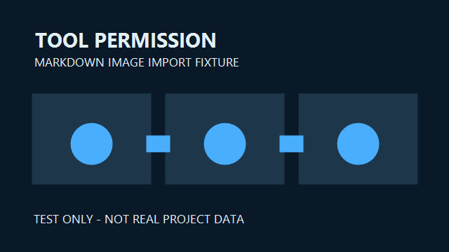
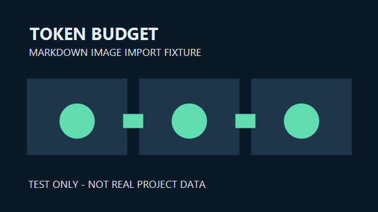

# Markdown 图片导入测试笔记

> 测试数据：本文完全虚构，仅用于验证 Markdown 导入、图片关联、预览与导出；不得作为阿霾的真实项目或公开文章发布。

## 测试目标

一篇笔记同时引用两张本地 PNG 图片。导入时应把它们与文章草稿关联；若移除任意一张图片，界面应提示缺失引用，不得自动发布。



## 检查清单

1. 标题、引用和列表是否正确显示。
2. 两张图片在草稿预览和导出文件中是否正常显示。
3. 缺失图片时能否指出具体文件。
4. 导入后文章是否仍处于草稿状态。



示例链接：[返回作品集预览](../../prototypes/concept-a.html)。

```text
fixture = true
publish = false
```
