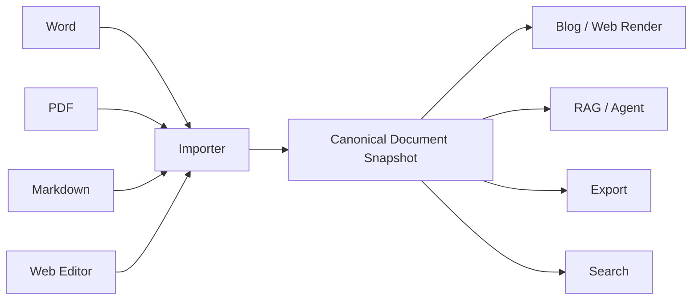
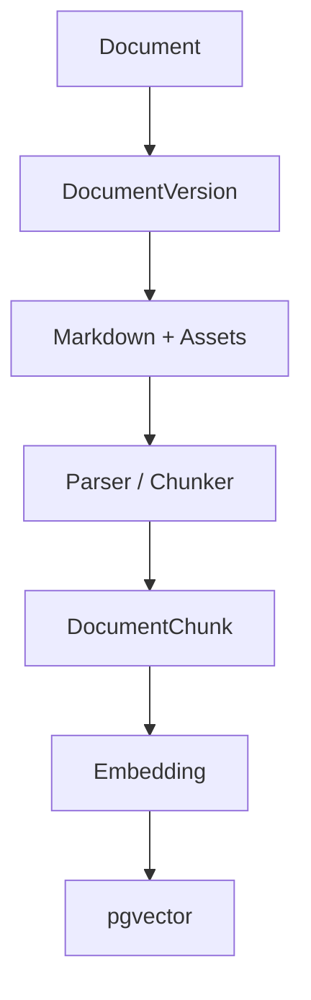
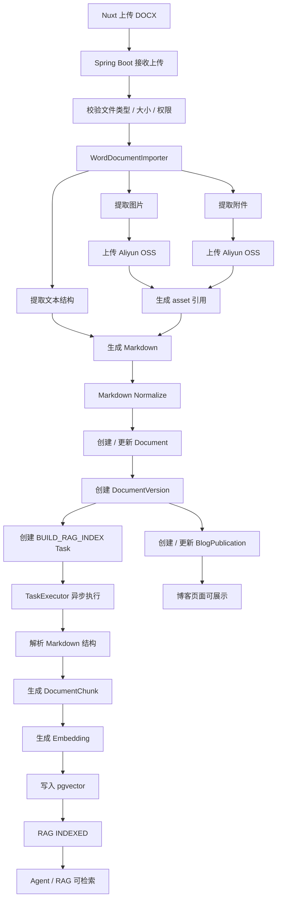
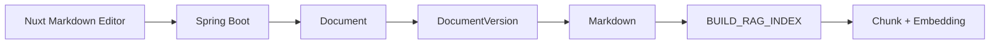
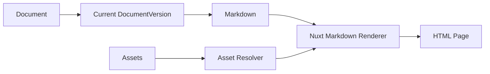
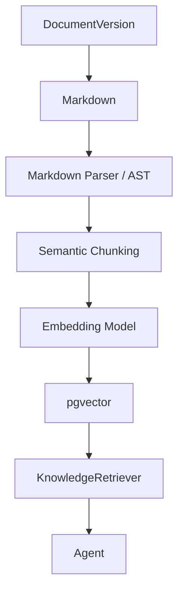
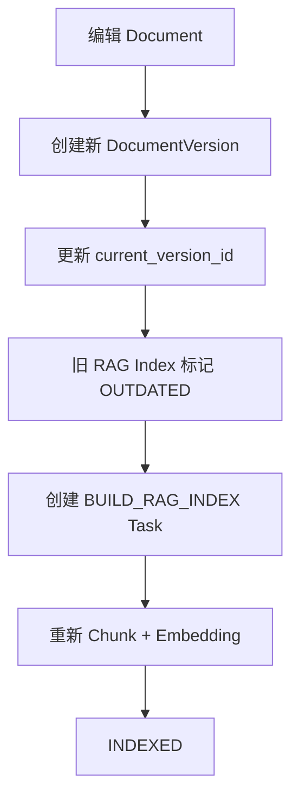
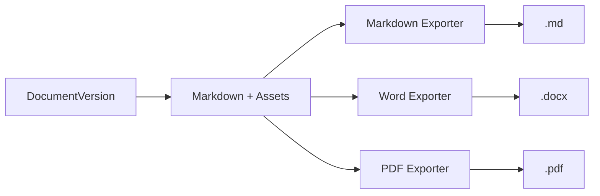
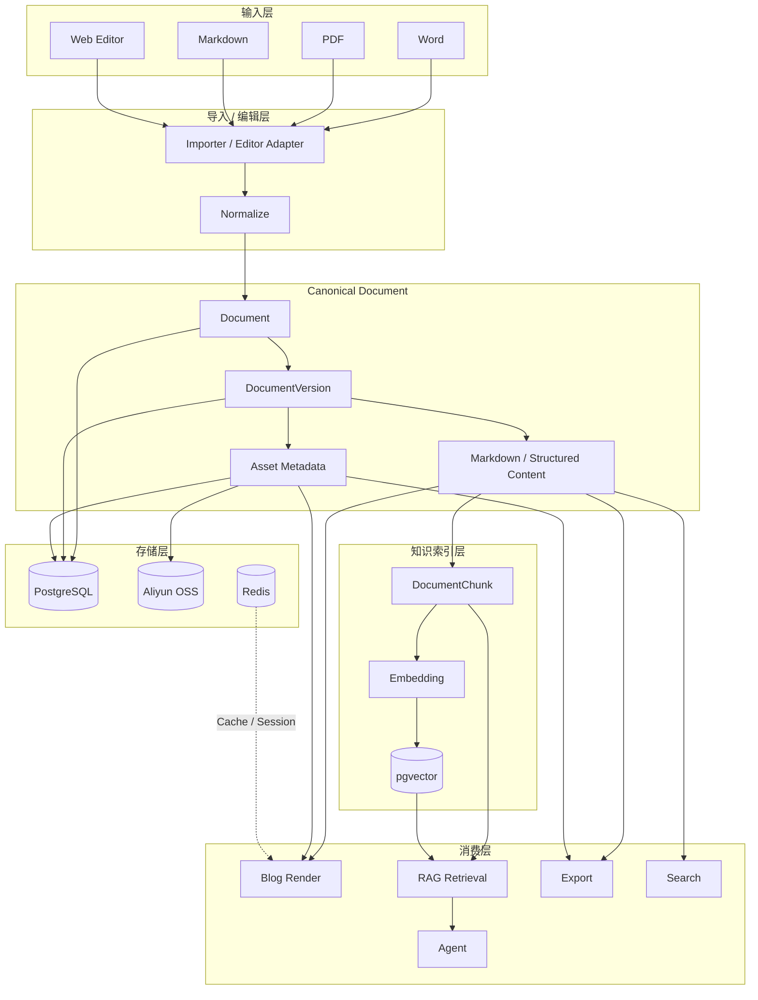

# 统一文档内容架构设计

> 适用项目：Spring Boot + Nuxt  
> 用途：供开发人员与 Codex 理解并实现博客、文档管理、导入导出、知识库与 Agent/RAG 能力。  
> 本文档描述当前已经确认的核心抽象、业务链路和技术选型。后续开发应优先遵循本文档，不得自行拆出彼此独立的“博客内容系统”“文档系统”“知识库系统”。

---

# 1. 设计目标

系统需要同时支持：

- 网站内直接编辑博客/文档
- 导入 Markdown、Word、PDF 等格式
- 博客展示
- 文档管理
- 导出 Markdown、Word、PDF
- RAG 知识库检索
- 后续 Agent 使用文档知识
- 图片、附件等资源统一管理
- 文档版本管理
- 异步构建 Chunk / Embedding / 索引

核心要求不是“保存某种文件格式”，而是：

> **完整保存文档所承载的信息，并保证这些信息能够被正常展示、检索、导出和被 Agent 使用。**

---

# 2. 核心抽象

系统中的核心对象不是 Word、PDF、Markdown 文件，也不是 Blog Article。

核心对象是：

```text
Document
```

`Document` 表示一份可被系统管理和使用的“信息实体”。

一个 Document 的完整信息由以下部分组成：

```text
Document
├── Metadata
├── Version
└── Snapshot
    ├── Structured Text / Markdown
    └── Assets
        ├── Image
        ├── Attachment
        ├── Audio
        ├── Video
        └── Other Binary Resources
```

其中：

- `Metadata`：标题、标签、作者、状态等通用信息
- `Version`：文档版本
- `Snapshot`：某一版本下完整的信息快照
- `Markdown / Structured Text`：正文语义内容
- `Assets`：正文引用的图片、附件和其他二进制资源

---

# 3. 文件格式不是核心模型

Word、PDF、Markdown 都只是输入或输出格式。

它们不应该决定系统内部的数据模型。



系统一旦完成导入，就不再关心这份内容原来来自：

- `.docx`
- `.pdf`
- `.md`
- Web Editor

后续所有业务都只面向统一的 `Document`。

---

# 4. Canonical Document

统一文档模型可以理解为：

```text
Canonical Document
=
Metadata
+
Version
+
Structured Content
+
Assets
```

当前实现中：

> **Markdown 是正文文本部分的主要 Canonical Representation。**

但是完整 Document 并不等于 Markdown。

完整内容应理解为：

```text
Document Snapshot
=
Markdown
+
Assets
+
Metadata
+
Version
```

例如原 Word：

```text
标题：Spring Boot

正文……

[架构图]

详见附件 design.xlsx
```

导入后：

```markdown
# Spring Boot

正文……


[附件：design.xlsx](asset://10002)
```

而对应资源：

```text
asset 10001 -> OSS image
asset 10002 -> OSS attachment
```

这样才能真正保证文档信息完整。

---

# 5. Source of Truth

各类数据必须有明确的最终可信来源。

```text
Document Identity       -> PostgreSQL
Document Metadata       -> PostgreSQL
Document Version        -> PostgreSQL
Markdown Content        -> PostgreSQL
Asset Metadata          -> PostgreSQL
Binary Asset            -> Aliyun OSS
Blog Publication Info   -> PostgreSQL
RAG Chunk               -> PostgreSQL
Embedding               -> pgvector
Cache                   -> Redis
Rendered HTML           -> Derived Data
Markdown AST            -> Derived Data
Vector Index            -> Derived Data
```

原则：

> PostgreSQL + OSS 保存真实内容。

> Chunk、Embedding、HTML、AST 都必须可以重新生成。

---

# 6. 博客不是独立内容系统

博客只是 Document 的一种使用方式。

不应该设计：

```text
blog_article.content
```

和：

```text
knowledge_document.content
```

两套正文。

正确关系：

```text
Document
├── DocumentVersion
│   └── Markdown + Assets
├── BlogPublication
└── RagIndex
```

博客额外只保存发布信息，例如：

```text
slug
summary
cover_asset_id
published_at
visibility
```

正文始终来自当前 `DocumentVersion`。

---

# 7. 知识库不是独立内容系统

RAG 不应该复制一份文档正文。

RAG 只是 Document 的派生索引。



因此：

```text
DocumentVersion = Source of Truth
DocumentChunk    = Derived Data
Embedding        = Derived Data
```

所有 RAG 数据都必须允许删除并重建。

---

# 8. 文档用途不是文档类型

“博客”“知识库”“搜索”“Agent”不是互斥的 Document Type。

同一份 Document 可以同时：

```text
用于博客展示
加入知识库
允许全文搜索
被 Agent 使用
允许导出
```

因此不要设计成：

```text
type = BLOG
type = RAG
```

然后通过大量 `if/else` 区分。

更合理的是：

```text
Document
+
Capabilities / Usage
```

例如：

```text
blog_enabled
rag_enabled
search_enabled
export_enabled
```

或者通过独立关联模型表达用途。

---

# 9. 信息完整性的定义

系统需要保证：

> **语义信息不丢失。**

不要求原始文件格式和排版 100% 还原。

应尽量保留：

```text
正文文字
标题层级
列表
表格
代码块
引用
链接
图片
附件
公式
结构关系
```

不要求完整保留：

```text
Word 字体
页边距
分页位置
复杂 WordArt
复杂浮动排版
像素级版式
```

如果未来业务要求“完全保留原始排版”，才需要长期保存原文件。

当前设计优先保证：

> 内容可理解、可展示、可检索、可导出、可被 Agent 使用。

---

# 10. 技术选型

当前技术栈：

```text
Frontend        Nuxt
Backend         Spring Boot
Primary DB      PostgreSQL
Vector Search   pgvector
Cache           Redis
Object Storage  Aliyun OSS
Content Format  Markdown
Async           Spring TaskExecutor
Recovery        Retry + Scheduled Recovery
```

当前阶段不引入：

```text
MongoDB
Elasticsearch
Qdrant
Milvus
RabbitMQ
RocketMQ
Kafka
```

除非未来真实业务规模证明有必要。

原则：

> 抽象可以提前设计，基础设施不要提前堆。

---

# 11. PostgreSQL 职责

PostgreSQL 负责：

```text
Document
DocumentVersion
Metadata
Blog Publication
Asset Metadata
Processing Task
DocumentChunk
RAG Index Status
Embedding
```

推荐核心表：

```text
document
document_version
blog_post
document_asset
document_chunk
document_processing_task
```

根据实际需求再增加：

```text
tag
document_tag
category
document_permission
```

---

# 12. pgvector 职责

pgvector 当前直接承担向量检索。

```text
document_chunk
├── content
├── metadata
└── embedding VECTOR
```

当前阶段不需要额外引入独立 Vector DB。

未来如果规模上升，可以替换：

```text
pgvector
    ↓
Qdrant / Milvus
```

但上层 `Document`、`KnowledgeRetriever` 等抽象保持不变。

---

# 13. Redis 职责

Redis 只用于：

```text
缓存
Session / Token 临时状态
限流
热点数据
临时锁
短生命周期状态
```

当前不使用 Redis Streams 作为消息队列。

原因：

- 写任务主要由单一管理员触发
- 文档数量不大
- 写入和修改不频繁
- 没有高并发文档处理需求

因此当前采用：

```text
TaskExecutor
+
Retry
+
Scheduled Recovery
```

更简单、成本更低。

---

# 14. Aliyun OSS 职责

OSS 不等于“保存上传文件”。

OSS 真正负责：

> 保存 Document 中无法直接作为结构化文本存储的二进制 Asset。

包括：

```text
图片
附件
音频
视频
其他二进制资源
```

默认情况下：

> Word / PDF 原文件只是导入载体，不要求长期保存。

例如 Word：

```text
DOCX
 ↓
提取文字
提取图片
提取附件
 ↓
Markdown + Assets
```

转换完成后，原 DOCX 没有继续存在的必要。

如果未来需要：

```text
下载原文件
重新转换
审计
完全恢复原格式
```

再增加原文件保留能力。

---

# 15. Asset 引用策略

Markdown 中不要直接固定 OSS 完整 URL。

推荐使用稳定的内部 Asset 引用：

```markdown


[下载附件](asset://10002)
```

渲染时：

```text
asset://10001
       ↓
AssetResolver
       ↓
Aliyun OSS object_key
       ↓
CDN / Signed URL / Public URL
```

这样未来：

```text
OSS 域名变更
CDN 切换
更换云厂商
权限模型调整
```

不需要批量修改 Markdown 正文。

---

# 16. Object Storage 抽象

业务代码不得直接依赖 Aliyun OSS SDK。

应定义基础设施接口：

```java
public interface ObjectStorage {

    StoredObject upload(...);

    InputStream read(...);

    void delete(...);

    String generateAccessUrl(...);
}
```

当前实现：

```text
AliyunOssObjectStorage
```

未来可替换：

```text
S3ObjectStorage
MinioObjectStorage
LocalObjectStorage
```

---

# 17. Word 博客导入全链路

示例：

> 用户上传一份 Word 格式博客，并希望博客可以正常展示，同时自动进入 RAG 知识库。

完整链路：



---

# 18. Word 导入后的数据形态

最终不会保存：

```text
xxx.docx
```

作为核心内容。

而是：

```text
PostgreSQL
├── document
├── document_version
│   └── markdown_content
├── blog_post
├── document_asset
└── document_chunk

Aliyun OSS
├── image-001.webp
├── image-002.png
└── attachment.xlsx

pgvector
└── embedding
```

原 Word 只是 Import Source。

---

# 19. 文档导入抽象

统一使用 Importer。

```java
public interface DocumentImporter {

    boolean supports(DocumentFormat format);

    ImportedDocument importDocument(...);
}
```

实现：

```text
MarkdownDocumentImporter
WordDocumentImporter
PdfDocumentImporter
```

Importer 输出统一结构：

```text
ImportedDocument
├── metadata
├── markdown
└── assets
```

任何格式差异必须在 Importer 层解决。

进入 Document 层后不得继续依赖原文件格式。

---

# 20. PDF 导入

PDF 导入同样输出统一 Document。

```text
PDF
 ↓
PdfDocumentImporter
 ↓
提取结构 / OCR / Layout Parse
 ↓
Markdown + Assets
```

需要明确：

> PDF → Markdown 属于尽力恢复语义结构，不保证原始版式完全一致。

扫描 PDF 后续可以增加：

```text
OCR
Layout Model
AI Document Parsing
```

但不影响 Document 模型。

---

# 21. 网站编辑器链路

网站直接编辑时不经过文件导入。



图片上传：

```text
Editor
 ↓
Upload Asset
 ↓
Aliyun OSS
 ↓
assetId
 ↓
Markdown 引用 asset://xxx
```

---

# 22. 博客展示链路



Spring Boot 返回：

```text
Document Metadata
+
Markdown
+
必要的 Asset 信息
```

Nuxt 负责最终 Markdown 渲染。

---

# 23. RAG 链路

RAG 只消费 DocumentVersion。



Chunk 应尽量基于语义结构，例如：

```text
Heading
Paragraph
Code Block
Table
List
```

而不是简单：

```text
每 500 字切一刀
```

---

# 24. Chunk 与 Version

每一个 Chunk 必须绑定：

```text
document_id
document_version_id
```

推荐字段：

```text
document_chunk
--------------
id
document_id
document_version_id
chunk_index
content
heading_path
token_count
embedding
created_at
```

这样当：

```text
current_version = 8
indexed_version = 7
```

可以明确判断：

```text
RAG INDEX OUTDATED
```

---

# 25. 文档修改链路

文档修改后：



旧版本内容仍可保留用于：

```text
历史记录
回滚
审计
版本比较
```

---

# 26. 导出链路

所有导出均从当前 DocumentVersion 生成。



推荐：

```text
Markdown -> UTF-8 .md

Markdown -> Pandoc / Converter -> DOCX

Markdown -> HTML -> Print CSS -> Headless Browser -> PDF
```

---

# 27. 异步任务设计

当前没有必要使用 MQ。

采用：

```text
Spring TaskExecutor
+
PostgreSQL Task State
+
Retry
+
@Scheduled Recovery
```

推荐任务：

```text
BUILD_RAG_INDEX
GENERATE_SUMMARY
GENERATE_TAGS
EXPORT_DOCUMENT
```

例如：

```text
document_processing_task
------------------------
id
task_type
resource_id
status
retry_count
max_retry_count
next_retry_at
started_at
finished_at
error_message
created_at
updated_at
```

状态：

```text
PENDING
PROCESSING
RETRY_WAIT
SUCCESS
FAILED
```

---

# 28. 异步任务恢复

TaskExecutor 只是执行机制。

PostgreSQL 才是任务真实状态来源。

```mermaid
flowchart TD
    P[PENDING] --> X[TaskExecutor]
    X --> R[PROCESSING]
    R -->|成功| S[SUCCESS]
    R -->|失败| W[RETRY_WAIT]
    W -->|达到重试时间| X
    W -->|超过最大次数| F[FAILED]

    SCH[@Scheduled Recovery] --> CHECK[扫描异常任务]
    CHECK --> P
    CHECK --> W
```

定时任务需要处理：

```text
PENDING 超时
PROCESSING 超时
RETRY_WAIT 到期
```

从而避免：

```text
应用重启
线程异常
Embedding API 超时
任务执行中断
```

导致任务永久丢失。

---

# 29. 为什么当前不使用 MQ

当前业务特征：

```text
写任务主要由管理员本人触发
文档数量少
修改频率低
没有高并发导入
没有多消费者复杂路由
没有大量事件流
```

因此：

```text
TaskExecutor + DB Task + Retry + Scheduled Recovery
```

已经足够。

未来出现：

```text
大量用户上传
高并发转换
多实例消费者
复杂异步链路
严格消息投递要求
```

再评估：

```text
Redis Streams
RabbitMQ
RocketMQ
Kafka
```

---

# 30. Agent 访问方式

未来 Agent 不直接访问具体表。

建议：

```java
public interface KnowledgeRetriever {

    List<KnowledgeChunk> retrieve(
        RetrievalQuery query
    );
}
```

当前实现：

```text
PostgreSQL + pgvector
```

未来可以替换：

```text
Qdrant
Milvus
Hybrid Search
```

Agent 层不需要知道底层实现。

---

# 31. 推荐模块边界

后端可以按能力组织：

```text
document
├── domain
├── application
├── repository
├── importer
├── exporter
├── asset
├── version
└── processing

blog
└── publication

knowledge
├── chunk
├── embedding
├── indexing
└── retrieval

storage
└── oss

task
└── async processing
```

原则：

> Document 管内容本体。

> Blog 管发布。

> Knowledge 管索引和检索。

> Storage 管二进制资源。

> Task 管异步任务生命周期。

---

# 32. Codex 开发约束

Codex 开发相关功能时必须遵守：

1. 不得把 Word、PDF、Markdown 设计成不同业务模型。
2. 不得为 Blog 和 Knowledge Base 创建两套正文。
3. 核心对象必须是 `Document`。
4. Document 的完整内容是 `Markdown + Assets + Metadata + Version`。
5. Markdown 只是文本内容表示，不等于完整 Document。
6. 所有二进制 Asset 统一进入 OSS。
7. OSS 只保存二进制资源，不保存 Document 主数据。
8. 默认不长期保存上传的 DOCX/PDF 原文件。
9. 如果未来需要原文件下载或审计，再增加 source file retention。
10. Markdown 中优先使用稳定 Asset 引用，不直接绑定 OSS 完整 URL。
11. DocumentVersion 是正文历史和 RAG 同步的基础。
12. Chunk 必须绑定 DocumentVersion。
13. Embedding 必须可删除和重建。
14. RAG 不得成为正文 Source of Truth。
15. Blog 不得拥有独立正文。
16. Importer / Exporter 必须隔离格式差异。
17. Document 进入系统后，业务层不得继续依赖原文件类型。
18. Agent 不得直接依赖数据库表。
19. 当前异步使用 TaskExecutor，不引入 MQ。
20. 所有异步任务必须有 Retry 和 Scheduled Recovery。
21. Redis 不得存储唯一核心业务状态。
22. PostgreSQL 是结构化数据和正文 Source of Truth。
23. Aliyun OSS 是 Asset Source of Truth。
24. pgvector 是可重建的索引。
25. 所有设计优先保证语义信息完整，而不是原文件版式完全一致。

---

# 33. 最终架构总览



---

# 34. 最终结论

整个系统的核心不是：

```text
保存 Word
保存 PDF
保存 Markdown
```

而是：

> **保存 Document 所承载的信息。**

统一模型：

```text
Document
└── Version
    └── Snapshot
        ├── Markdown / Structured Content
        └── Assets
```

Word、PDF、Markdown、Web Editor 只是输入方式。

Blog、RAG、Agent、Search、Export 只是消费方式。

最终技术选型：

```text
Nuxt
Spring Boot
PostgreSQL + pgvector
Redis
Aliyun OSS
Spring TaskExecutor
```

架构原则：

> **统一 Document，统一内容生命周期，统一资源管理；不同格式只在边界转换，不让格式差异污染核心业务。**
